# DevFlow Suite — Hackathon Technical Roadmap & Team Onboarding Guide

> **Team:** Terraformers Anonymous — Hans Havlik, Jamil Al Bouhairi, Ricardo Reyes-Jimenez, Uma Bharti  
> **Hackathon:** Microsoft Global Partner Hackathon — Capgemini  
> **Use Case:** Agentic DevOps Automation  
> **Last updated:** 2026-03-14

---

## Table of Contents

1. [Executive Summary](#1-executive-summary)
2. [System Architecture](#2-system-architecture)
3. [Workflow Diagrams](#3-workflow-diagrams)
4. [Component Inventory & Status](#4-component-inventory--status)
5. [Gap Analysis — What Needs to Be Built](#5-gap-analysis--what-needs-to-be-built)
6. [MVP Roadmap](#6-mvp-roadmap)
7. [Demo Script](#7-demo-script-5-minutes)
8. [Team Onboarding & First-Run Checklist](#8-team-onboarding--first-run-checklist)
9. [Key Decisions for Monday](#9-key-decisions-for-monday)

---

## 1. Executive Summary

**The Problem:** Software developers and IT support teams waste time on repetitive, low-value tasks — boilerplate code, routine code reviews, issue triage, sprint board management — all requiring constant context-switching between tools.

**Our Solution: DevFlow Suite**

A platform-agnostic developer toolsuite that eliminates context-switching entirely. Developers manage GitHub Issues, PRs, sprint boards, code reviews, and Azure DevOps work items through **natural language in GitHub Copilot Chat inside VS Code** — without ever opening a browser. The same UX works against both GitHub Projects and Azure DevOps Boards by simply switching the active agent. Automated GitHub Actions pipelines handle the event-driven half (PR review, issue triage, release notes) backed by Azure OpenAI.

**The unique angle:** Nobody has shipped a platform-agnostic, MCP-first orchestration layer that bridges project management intelligence with code execution. We directly exploit the gap between GitHub's native Copilot Coding Agent and the Microsoft Azure DevOps ecosystem — all within VS Code.

---

## 2. System Architecture

### 2.1 Three-Layer Architecture Overview

The system has three independent but cooperating layers. Layer 1 is developer-initiated (chat). Layer 2 is event-driven (GitHub Actions). Layer 3 is the shared Azure AI backend.

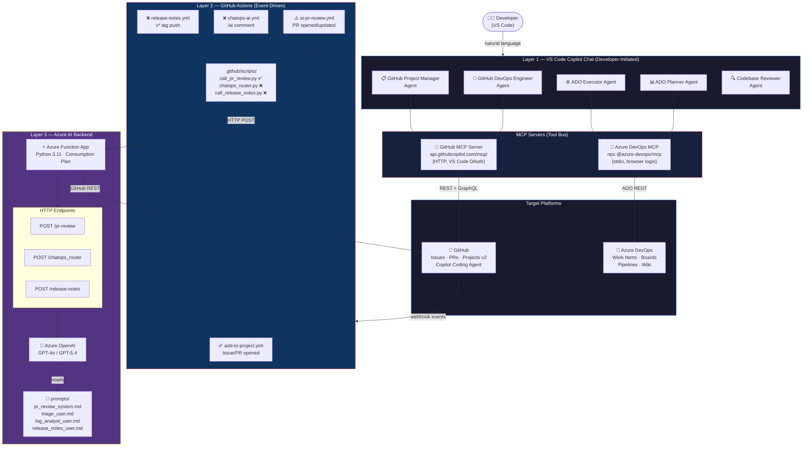

### 2.2 Component Map

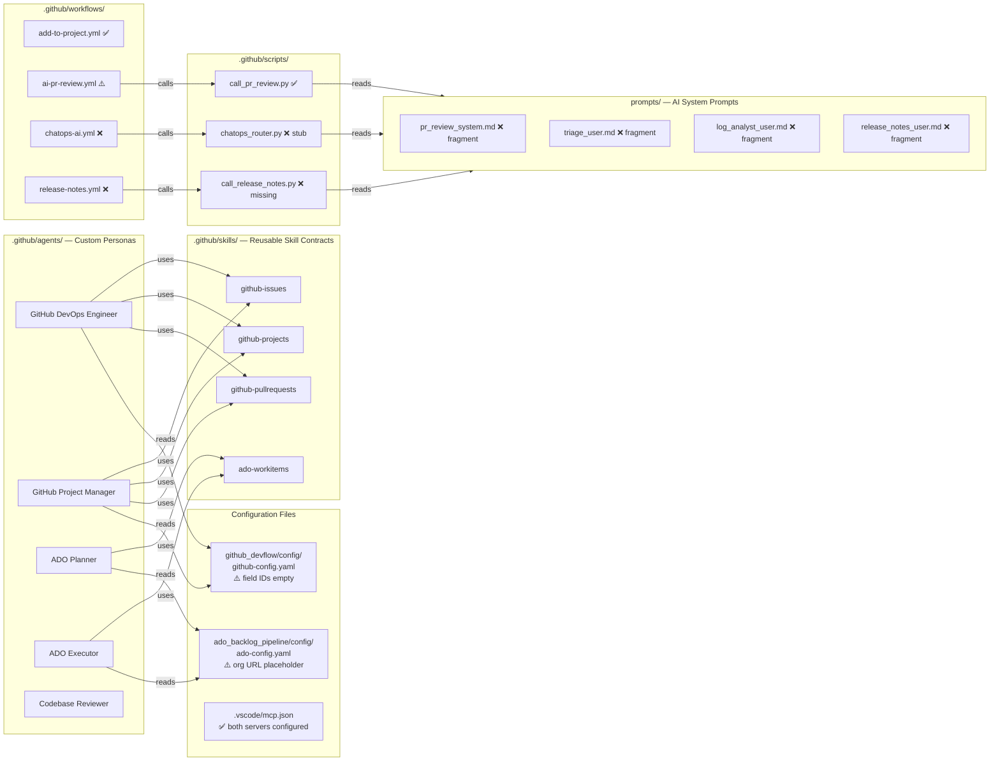

### 2.3 MCP Tool Flow — Natural Language to Platform Action

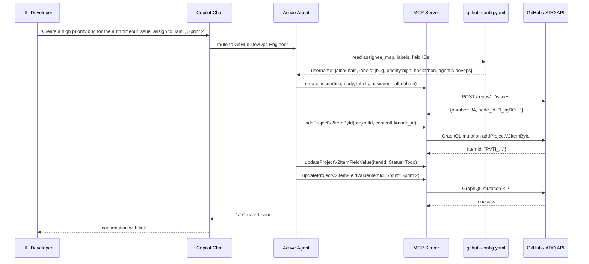

---

## 3. Workflow Diagrams

### 3.1 Automated PR Review Pipeline

Fires automatically on every opened or updated Pull Request. The Python script fetches the diff, calls the Azure Function, then annotates the PR and optionally fails the job to block merge.

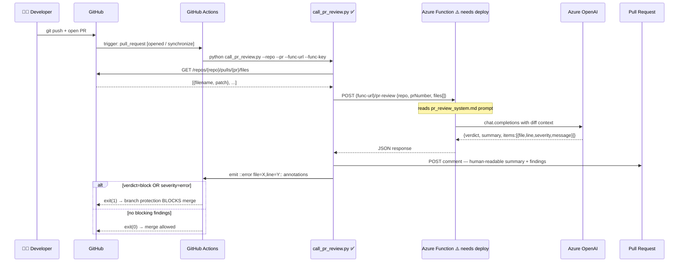

### 3.2 Issue → Copilot Coding Agent → Merged PR (Full Autonomous Loop)

The most powerful demo flow. One natural language command in VS Code → Copilot Coding Agent handles the entire implementation autonomously.

```mermaid
sequenceDiagram
    participant Dev as 👨‍💻 Developer (VS Code)
    participant Chat as Copilot Chat
    participant GH_MCP as GitHub MCP Server
    participant GH as GitHub
    participant CA as Copilot Coding Agent 🤖
    participant Actions as GitHub Actions

    Dev->>Chat: "Copilot, implement issue #23 — the login timeout bug"
    Chat->>GH_MCP: copilot toolset: assign issue #23 to @copilot
    GH_MCP->>GH: PATCH /issues/23 → assign copilot[bot]
    GH->>CA: coding agent task triggered

    rect rgb(40, 60, 40)
        Note over CA,GH: Autonomous execution — no human involvement
        CA->>GH: create branch copilot/fix-login-timeout-23
        CA->>CA: read issue context + related code files
        CA->>CA: implement fix + write/update tests
        CA->>GH: push commits
        CA->>GH: open PR "Fix login timeout (Closes #23)"
    end

    GH->>Actions: trigger ai-pr-review.yml
    Actions-->>GH: AI review comment posted on PR
    GH-->>Dev: 🔔 PR #31 ready for review

    Dev->>Chat: "Review PR #31 and approve if it looks good"
    Chat->>GH_MCP: get_pull_request_files(31)
    Chat->>GH_MCP: add_pull_request_review(31, APPROVE)

    Dev->>Chat: "Merge PR #31"
    Chat->>GH_MCP: merge_pull_request(31, squash)
    GH-->>GH: issue #23 auto-closed via "Closes #23"
    Chat-->>Dev: "✅ PR #31 merged — issue #23 closed"
```

### 3.3 ChatOps Pipeline (/ai Comment Commands)

Team members trigger AI actions by commenting `/ai <command>` on any GitHub Issue. Currently stubbed — needs `chatops_router.py` and Azure Function endpoint.

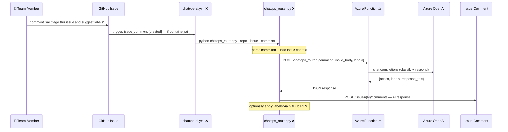

### 3.4 ADO CSV Backlog Pipeline

The ADO side uses a local CSV as a push gate. All changes flow through the CSV before hitting ADO; the `_row_dirty=1` flag controls what gets pushed.

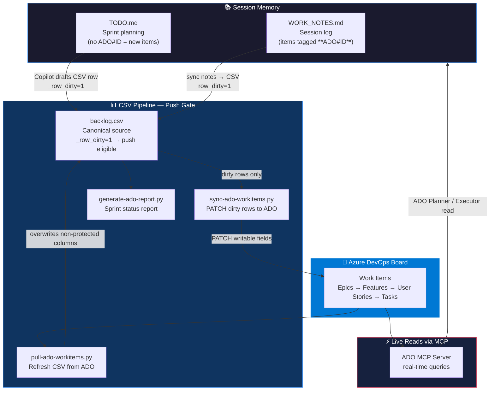

### 3.5 Platform Swap — Same UX, Different Backend

The core architectural value proposition: identical natural language, different active agent, different platform.

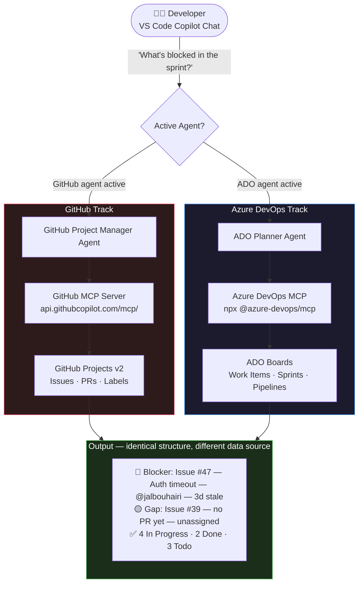

---

## 4. Component Inventory & Status

### 4.1 Agents

| Agent | File | Platform | Status | Blocker |
|---|---|---|---|---|
| GitHub DevOps Engineer | `.github/agents/GitHub DevOps Engineer.agent.md` | GitHub | ✅ Complete | `project_fields` IDs empty in config |
| GitHub Project Manager | `.github/agents/GitHub Project Manager.agent.md` | GitHub | ✅ Complete | `project_fields` IDs empty in config |
| ADO Planner | `.github/agents/ADO Planner.agent.md` | ADO | ✅ Complete | ADO org URL placeholder in `ado-config.yaml` |
| ADO Executor | `.github/agents/ADO Executor.agent.md` | ADO | ✅ Complete | ADO org URL placeholder in `ado-config.yaml` |
| Codebase Reviewer | `.github/agents/Codebase Review.agent.md` | Both | ✅ Complete | None |

### 4.2 Skills

| Skill | File | Status | Notes |
|---|---|---|---|
| `github-issues` | `.github/skills/github-issues/SKILL.md` | ✅ Complete | Requires `github-config.yaml` field IDs populated |
| `github-projects` | `.github/skills/github-projects/SKILL.md` | ✅ Complete | Requires `project_fields` IDs in config |
| `github-pullrequests` | `.github/skills/github-pullrequests/SKILL.md` | ✅ Complete | None |
| `ado-workitems` | `.github/skills/ado-workitems/SKILL.md` | ✅ Complete | Requires correct `ado-config.yaml` org URL |

### 4.3 GitHub Actions Workflows

| Workflow | Trigger | Status | What's Missing |
|---|---|---|---|
| `add-to-project.yml` | Issue/PR opened | ✅ Functional | `PROJECT_URL` + `PROJECT_TOKEN` secrets |
| `ai-pr-review.yml` | PR opened/updated | ⚠️ Wired, not deployed | Azure Function endpoint + `AI_PR_REVIEW_FUNC_URL` / `AI_PR_REVIEW_FUNC_KEY` secrets |
| `chatops-ai.yml` | `/ai` comment | ❌ Stub | `chatops_router.py` implementation + Azure Function endpoint |
| `release-notes.yml` | `v*` tag push | ❌ Broken | `call_release_notes.py` does not exist |

### 4.4 Scripts

| Script | Status | Notes |
|---|---|---|
| `.github/scripts/call_pr_review.py` | ✅ Implemented | Full: fetches diff, calls Function, posts comment, gates merge |
| `.github/scripts/chatops_router.py` | ❌ Stub | Single `# TODO` comment — needs full implementation |
| `.github/scripts/call_release_notes.py` | ❌ Missing | File doesn't exist — workflow will crash at runtime |

### 4.5 Azure AI Backend (Not Yet Deployed)

| Endpoint | Prompt File | Status | Required Response Schema |
|---|---|---|---|
| `POST /pr-review` | `prompts/pr_review_system.md` | ❌ Not deployed | `{verdict, summary, items:[{file,line,severity,message,suggestion_patch}]}` |
| `POST /chatops_router` | `prompts/triage_user.md` | ❌ Not deployed | `{action, labels, response_text}` |
| `POST /release-notes` | `prompts/release_notes_user.md` | ❌ Not deployed | `{title, summary, sections[]}` |

### 4.6 Configuration Files

| File | Status | Blocking Issue |
|---|---|---|
| `.vscode/mcp.json` | ✅ Complete | Both MCP servers configured; ADO prompts for org + PAT on first use |
| `github_devflow/config/github-config.yaml` | ⚠️ Incomplete | All `project_fields` IDs are empty strings — blocks ALL board writes |
| `ado_backlog_pipeline/config/ado-config.yaml` | ⚠️ Incomplete | `org_url` is `RARJ-CAP` placeholder; assignee emails need confirmation |

---

## 5. Gap Analysis — What Needs to Be Built

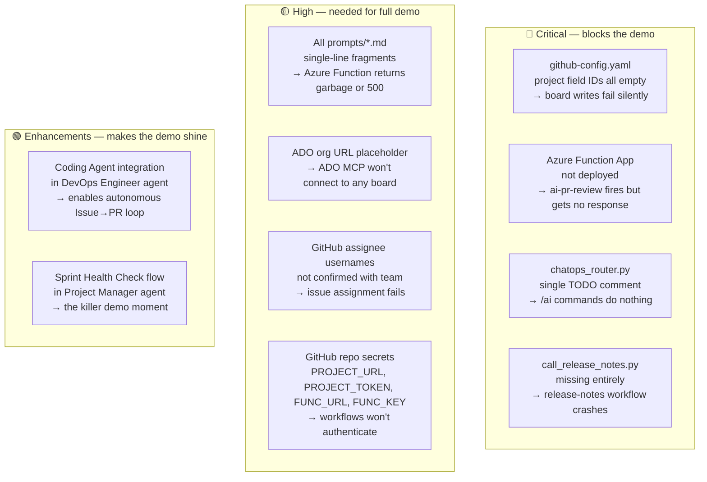

### Priority Build Order

| # | Task | Effort | Suggested Owner | Impact |
|---|---|---|---|---|
| 1 | Populate `github-config.yaml` field IDs via MCP query | 1h | Hans | Unblocks ALL board operations |
| 2 | Confirm GitHub usernames + set `PROJECT_URL` / `PROJECT_TOKEN` secrets | 30m | Hans | Unblocks `add-to-project` workflow |
| 3 | Fix `ado-config.yaml` org URL + confirm assignee emails | 30m | Hans / Ricardo | Unblocks ADO MCP connection |
| 4 | Write 4 prompt files with JSON-schema output spec | 3h | Jamil / Uma | Required before Azure Function can work |
| 5 | Deploy Azure Function App — 3 HTTP endpoints | 3h | Ricardo / Hans | Unblocks `ai-pr-review` workflow |
| 6 | Set `AI_PR_REVIEW_FUNC_URL` + `KEY` repo secrets | 15m | Hans | Connects workflow to deployed Function |
| 7 | Implement `chatops_router.py` | 2h | Jamil | Completes `chatops-ai.yml` pipeline |
| 8 | Create `call_release_notes.py` | 2h | Uma | Fixes broken `release-notes.yml` workflow |
| 9 | Add Coding Agent integration to DevOps Engineer agent | 1h | Hans | Enables autonomous Issue→PR loop |
| 10 | Add Sprint Health Check to Project Manager agent | 1h | Hans | Enables the killer demo moment |

---

## 6. MVP Roadmap

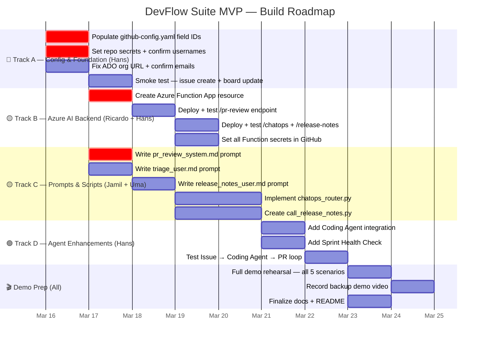

### Parallel Work Tracks

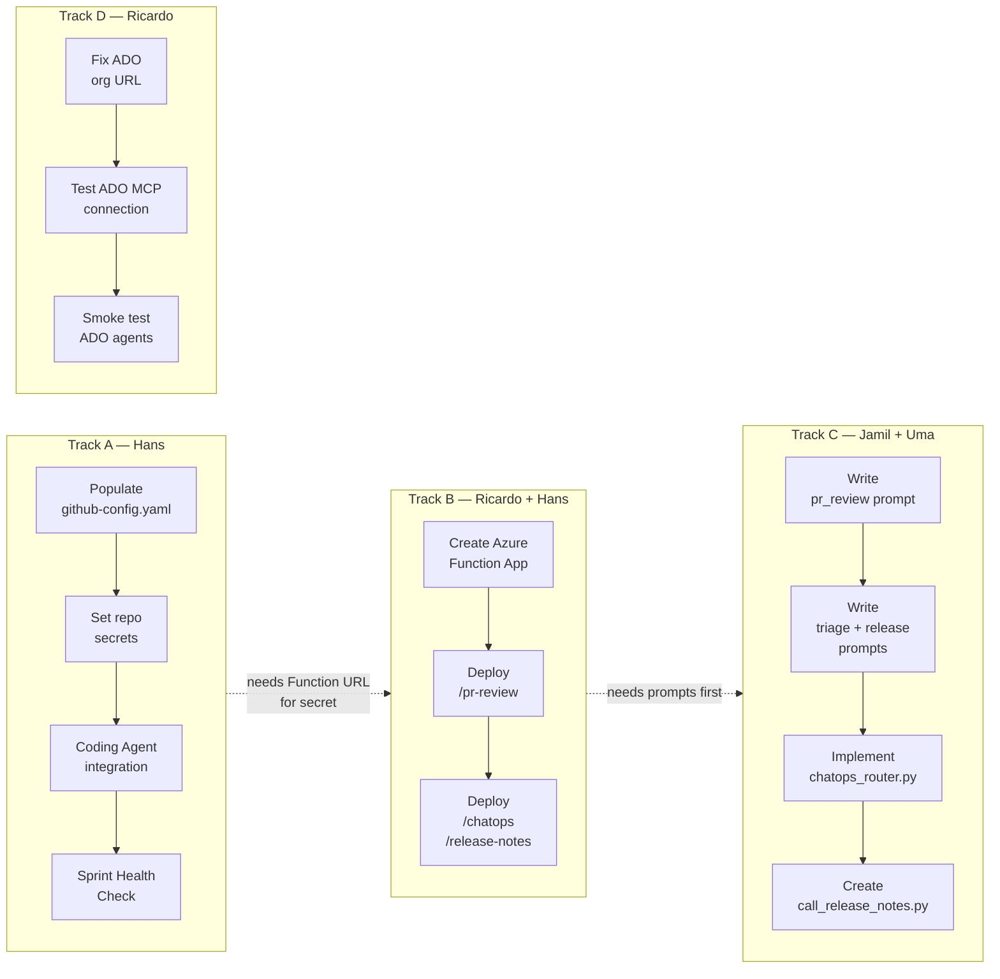

---

## 7. Demo Script (5 Minutes)

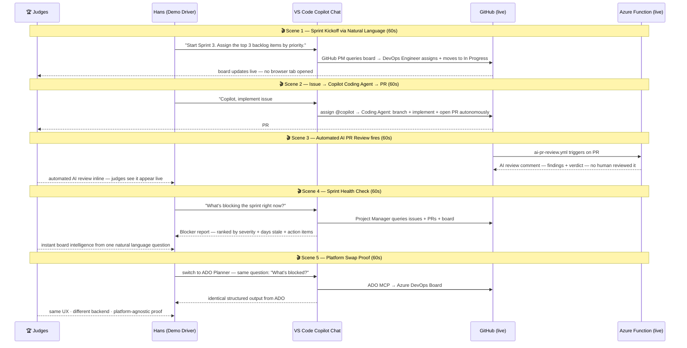

### Demo Environment Checklist

- [ ] GitHub repo has 6–8 open issues with varying status and priority
- [ ] At least one issue tagged "ready to implement" (Coding Agent candidate)
- [ ] GitHub Projects v2 board: Sprint 2 active + Sprint 3 planned with backlog items
- [ ] Azure Function App deployed and `/health` endpoint returns 200
- [ ] All GitHub repo secrets set: `PROJECT_URL`, `PROJECT_TOKEN`, `AI_PR_REVIEW_FUNC_URL`, `AI_PR_REVIEW_FUNC_KEY`
- [ ] `github-config.yaml` — all `project_fields` IDs populated (not empty strings)
- [ ] VS Code GitHub OAuth active (MCP server shows authenticated)
- [ ] ADO MCP authenticated (browser login completed at least once)
- [ ] `ado-config.yaml` org URL corrected to real ADO org
- [ ] Backup screen recording ready in case live demo has connectivity issues

---

## 8. Team Onboarding & First-Run Checklist

### 8.1 Prerequisites

| Requirement | Why | How |
|---|---|---|
| VS Code with GitHub Copilot extension | Runs all agents and MCP servers | VS Code marketplace |
| GitHub Copilot Pro or Business plan | Required for agent mode + Coding Agent | GitHub account settings |
| `Terraformers-Anonymous` org membership | Required for repo write + issue assignment | Ask Hans to invite |
| Node.js ≥ 18 | Required for `npx @azure-devops/mcp` | [nodejs.org](https://nodejs.org) |
| Python 3.11 | Required for ADO pipeline scripts | [python.org](https://python.org) |
| Azure subscription access | Required to deploy Function App | Confirm with Hans |
| ADO org access | `dev.azure.com/{org}` — confirm org name Monday | Confirm with team |

### 8.2 Repository Setup (Each Team Member)

```bash
# 1. Clone
git clone https://github.com/Terraformers-Anonymous/hackathon-project.git
cd hackathon-project

# 2. Python virtual environment
python -m venv .venv
.venv\Scripts\activate          # Windows
source .venv/bin/activate       # Mac / Linux

# 3. Install dependencies
pip install -r requirements.txt

# 4. ADO credentials (gitignored — each dev keeps their own)
# Create ado_backlog_pipeline/.env:
#   ADO_PAT=<your_personal_access_token>
#   ADO_ORG_URL=https://dev.azure.com/<org>   (confirm Monday)
#   ADO_PROJECT=<project name>                (confirm Monday)

# 5. Open in VS Code — MCP servers auto-start
code .
```

### 8.3 VS Code Agent Setup

When VS Code opens:
1. **GitHub MCP server** starts automatically via HTTP — uses your VS Code GitHub OAuth, no PAT needed
2. **ADO MCP server** starts on first use — a browser popup asks for Microsoft login
3. To test: open Copilot Chat (Ctrl+Alt+I) → try the first-run tests below

### 8.4 First-Run Smoke Tests

| Test | Copilot Chat Command | Expected Result |
|---|---|---|
| GitHub MCP connected | `@GitHub Project Manager list all open issues` | Lists issues from the repo |
| Board read works | `@GitHub Project Manager show project board state` | Lists board items with Status field |
| ADO MCP connected | `@ADO Planner show current sprint items` | Lists ADO work items (triggers browser login first time) |
| Board write works | `@GitHub DevOps Engineer create a test task, assign to me, Sprint 1` | Creates issue #N + adds to board |
| PR review works | Open a test PR → watch `ai-pr-review.yml` run | AI review comment appears on PR *(needs Function deployed)* |

### 8.5 ADO Scripts Quick Reference

Always run from the **repository root**:

```bash
# Pull latest ADO state into backlog.csv
python ado_backlog_pipeline/scripts/pull-ado-workitems.py

# Dry run — preview what would be pushed
python ado_backlog_pipeline/scripts/sync-ado-workitems.py --dry-run

# Push dirty rows to ADO
python ado_backlog_pipeline/scripts/sync-ado-workitems.py

# Sprint status report
python ado_backlog_pipeline/scripts/generate-ado-report.py

# Add work note to an ADO item
python ado_backlog_pipeline/scripts/add-ado-comment.py --id <ADO_ID> --note "Your note here"

# Set default priorities on blank rows
python ado_backlog_pipeline/scripts/set-priority.py --dry-run
```

### 8.6 Copilot Session Memory Conventions

The ADO Planner and Executor agents treat these files as session memory:

| File | Purpose | Convention |
|---|---|---|
| `ado_backlog_pipeline/data/TODO.md` | Sprint planning scratchpad | Items without `ADO#ID` = new work items to create |
| `ado_backlog_pipeline/data/WORK_NOTES.md` | Session work log | Tag every entry with `**ADO#12345**` for sync |

**Workflow:**
1. Jot work in `WORK_NOTES.md` with `**ADO#ID**` tags during a session
2. Say _"sync my work notes"_ → Copilot drafts CSV updates for tagged items
3. Say _"archive my session notes"_ → moves Active Session to Archive, resets for next session

---

## 9. Key Decisions for Monday

Bring these to the team discussion. Each has a recommendation but needs team alignment before work begins.

---

### Decision 1 — Azure Subscription for Function App

> **Question:** Which Azure subscription hosts the Azure OpenAI resource and Function App?

| Option | Pros | Cons |
|---|---|---|
| Hackathon lab subscription | Zero cost, may be pre-provisioned | May not be available for all regions/models |
| Hans's personal Azure subscription | Fastest to set up, full control | Personal cost if hackathon credits don't cover |
| Capgemini enterprise subscription | Most secure, production-grade | May require approval time we don't have |

**Recommendation:** Use hackathon lab subscription if provided; otherwise Hans's personal subscription for speed.

---

### Decision 2 — Azure OpenAI Model

> **Question:** GPT-4o (available today) or GPT-5.4 (announced March 3, GA soon)?

| Model | Status | Code Review Quality | Cost |
|---|---|---|---|
| GPT-4o | GA, all regions | Good | Lower |
| GPT-5.4 | Announced March 3, limited GA | Excellent for reasoning | Higher |

**Recommendation:** Deploy with GPT-4o. Write prompts to be model-agnostic. Swap to GPT-5.4 at demo time if it's available in the target region.

---

### Decision 3 — Azure Function App vs. Azure AI Foundry Agent Service

> **Question:** Simpler Function App (already wired in workflows) or migrate to Foundry Agent Service for a stronger "native agentic" story?

| Approach | Time to Demo | Judge Appeal | Risk |
|---|---|---|---|
| Azure Function App + Azure OpenAI | Fast (already wired) | Good | Low |
| Azure AI Foundry Agent Service | Slower (new architecture) | Excellent ("built on Microsoft's agent platform") | Medium |

**Recommendation:** Azure Function App for the working MVP. Frame it in the pitch deck as "Azure AI-powered agents" — architecturally equivalent to Foundry. If time permits after MVP is stable, explore migrating one endpoint to Foundry for the demo narrative.

---

### Decision 4 — Confirm GitHub Org and Repo Names

> **Question:** Are these the exact names? `Terraformers-Anonymous` org, `hackathon-project` repo?

`github-config.yaml` and all 5 agents hardcode these values. If either name is different, update `github-config.yaml` first — everything else flows from that file.

**Action:** Hans to confirm live org URL and repo name before Monday, or first thing Monday morning.

---

### Decision 5 — Correct Azure DevOps Org Name

> **Question:** What is the real org URL for our ADO project?

`ado-config.yaml` currently has `https://dev.azure.com/RARJ-CAP` as a placeholder. The ADO MCP server and all pipeline scripts will fail until this is corrected. The project name (`Hackaton`) also needs verification.

**Action:** Ricardo or Hans to log in to `dev.azure.com` and confirm the exact org URL and project name before any ADO work begins.

---

### Decision 6 — Demo Scope: 5 Scenarios or Focus on 3?

> **Question:** Attempt all 5 demo scenarios live, or rehearse the 3 strongest thoroughly?

| Scope | Strongest Scenarios | Risk |
|---|---|---|
| All 5 | Full story, maximum impact | Higher chance of a live failure |
| Best 3 | Sprint kickoff + AI PR review + platform swap | More reliable, very distinctive |

**Recommendation:** Rehearse all 5 but have a rehearsed skip plan for Scenes 2 and 3 (Coding Agent + live PR) if time or connectivity is a risk. Record a backup demo video covering all 5 regardless.

---

*End of document — share with team before Monday standup.*
