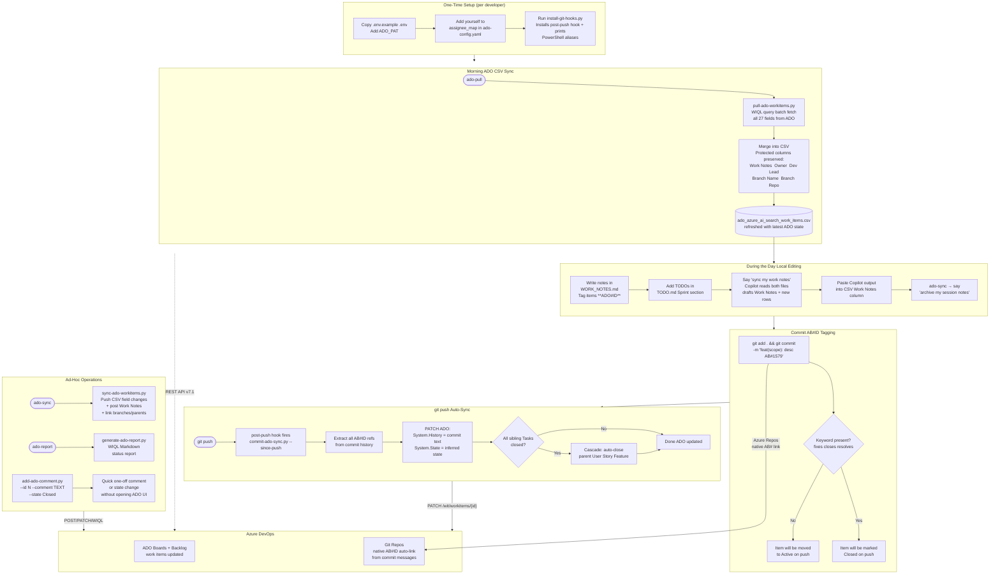

# ADO Backlog Automation

A self-contained bundle of scripts, prompts, and configuration for managing
Azure DevOps work items directly from your local CSV + git workflow
distributed automatically to every team member via `git pull`.

> **Copilot-native**  **Credentials isolated in bundle**  **Zero cloud infra required**

---

## 5-Minute Setup

```powershell
# 1.  Copy the .env template and fill in your ADO token
copy ado_backlog_pipeline\.env.example ado_backlog_pipeline\.env
#    Then open .env and set: ADO_PAT  (this is the only credential required)
#    See docs/ADO_AUTOMATION_PIPELINE_GUIDE.md Section 4.1 for PAT creation steps

# 2.  Add yourself to config/ado-config.yaml (assignee_map section)

# 3.  Install the post-push git hook (optional but recommended)
python ado_backlog_pipeline/scripts/install-git-hooks.py

# 4.  Run your first morning pull
python ado_backlog_pipeline/scripts/pull-ado-workitems.py

# 5.  (Optional) Copy the personal work log template
copy ado_backlog_pipeline\data\work-log.csv.template ado_backlog_pipeline\data\work-log.csv

# 6.  Open data/WORK_NOTES.md and start writing session notes
#     Tag work items with **ADO#<ID>** — Copilot will use these to draft your CSV updates
# 7.  Open data/TODO.md and add sprint tasks with the tagged item syntax
```

---

## How It Works  End-to-End Workflow



---

## Daily Workflow Summary

```
 Morning           During the Day              End of Day / After Push
                                                   
ado-pull            Write WORK_NOTES.md          Say "sync my work notes"
                    Tag items **ADO#ID**          Copilot drafts CSV updates
CSV refreshed       Add TODOs to TODO.md         Paste  ado-sync  ado-push
from ADO            ado-sync (mid-day optional)  Say "archive my session notes"
```

### PowerShell Aliases  _(add to `$PROFILE`  printed by `install-git-hooks.py`)_

| Command | Script | Action |
|---------|--------|--------|
| `ado-pull` | `pull-ado-workitems.py` |  Pull ADO  CSV |
| `ado-sync` | `sync-ado-workitems.py` |  Push CSV  ADO |
| `ado-sync-dry` | `sync-ado-workitems.py --dry-run` |  Preview push, no writes |
| `ado-report` | `generate-ado-report.py` |  Markdown status report |

---

## Folder Map

```
ado_backlog_pipeline/

  .env.example             # Template  copy to .env and fill in credentials
  .env                     # Your credentials (gitignored  never committed)
  .gitignore               # Ignores .env and data/work-log.csv within the bundle

   config/
    ado-config.yaml         # Team-shared config (safe to commit)

  data/
    ado_azure_ai_search_work_items.csv   # Primary backlog CSV (27 columns)
    work-log.csv.template                # Personal daily log template
    .gitignore                           # Excludes work-log.csv

  scripts/
    pull-ado-workitems.py   #   ADO -> CSV (morning sync)
    sync-ado-workitems.py   #   CSV -> ADO (push updates + planning fields)
    set-priority.py         #   Fill blank Priority with type-based defaults
    commit-ado-sync.py      #   Commits -> ADO notes + state (post-push)
    add-ado-comment.py      #   Quick one-off comment + state
    generate-ado-report.py  #   WIQL -> Markdown status report
    install-git-hooks.py    #   Install / remove post-push hook

  prompts/
     WORK_SESSION_SYNC_PROMPT.md    # Copilot prompt: PRIMARY daily driver — reads WORK_NOTES + TODO
     ADO_FULL_WORKITEM_PROMPT.md    # Copilot prompt: full CSV row
     ADO_UPDATE_ONLY_PROMPT.md      # Copilot prompt: targeted single-item update
     COMMIT_MESSAGE_PROMPT.md       # Copilot prompt: AB#ID commits

  data/
    ado_azure_ai_search_work_items.csv   # Primary backlog CSV (27 columns)
    WORK_NOTES.md                        # Technical session log (Copilot memory — Active Session + Archive)
    TODO.md                              # Sprint planning scratchpad (Sprint / Backlog / Done sections)
    work-log.csv.template                # Personal daily log template (gitignored copy)
    .gitignore                           # Excludes work-log.csv

.github/
 copilot-instructions.md     #  Auto-loaded by VS Code Copilot for all team members
```

---

## Scripts Reference

### `pull-ado-workitems.py`  Morning Sync (ADO  CSV)

```powershell
python scripts/pull-ado-workitems.py               # assigned to you, current sprint
python scripts/pull-ado-workitems.py --all          # all active items in project
python scripts/pull-ado-workitems.py --ids 1579 1580
python scripts/pull-ado-workitems.py --since 2025-01-01
python scripts/pull-ado-workitems.py --dry-run      # print changes, no file write
```

### `sync-ado-workitems.py`  Push CSV  ADO

```powershell
python scripts/sync-ado-workitems.py               # full sync
python scripts/sync-ado-workitems.py --dry-run
python scripts/sync-ado-workitems.py --row 5       # single row
python scripts/sync-ado-workitems.py --no-relations      # skip parent/branch linking
python scripts/sync-ado-workitems.py --relations-only    # link parents/branches only, no field updates
python scripts/sync-ado-workitems.py --relations-only --dry-run  # preview links without writing
```

### `commit-ado-sync.py`  Commit-Driven Updates

```powershell
python scripts/commit-ado-sync.py                  # since last push (default)
python scripts/commit-ado-sync.py --commits 10
python scripts/commit-ado-sync.py --ids 1579 1580
python scripts/commit-ado-sync.py --state-only     # state change only, no History comment
python scripts/commit-ado-sync.py --no-cascade
python scripts/commit-ado-sync.py --dry-run
```

### `set-priority.py`  Fill Missing Priorities

```powershell
python scripts/set-priority.py              # fill blanks, open items only
python scripts/set-priority.py --dry-run    # preview changes, no file write
python scripts/set-priority.py --report     # list gaps only, no changes
python scripts/set-priority.py --all        # include closed/done items too
python scripts/set-priority.py --ids 1601 1607
python scripts/set-priority.py --type Task
```

Defaults come from `config/ado-config.yaml` (`priority_defaults` section) and only fill **blank** cells — existing values are never overwritten. After running, use `ado-sync` to push to ADO.

### `add-ado-comment.py`  Quick Comment

```powershell
python scripts/add-ado-comment.py
# Prompts for: work item ID, comment text, new state (optional)
```

### `generate-ado-report.py`  Status Report

```powershell
python scripts/generate-ado-report.py              # active items for you
python scripts/generate-ado-report.py --all-active
python scripts/generate-ado-report.py --output report.md
```

---

## CSV Schema  27 Canonical Columns

| Column | Source | Notes |
|--------|--------|-------|
| `ID (ADO)` | ADO | Blank = new item on next sync |
| `Type` | ADO | Epic / Feature / User Story / Task |
| `Parent ID (ADO)` | ADO | Linked via Hierarchy-Reverse relation |
| `Title` | Both | Required |
| `Description` | ADO | HTML stripped on pull |
| `Blocker/Dependency` | CSV | Protected  not overwritten on pull |
| `Comments` | ADO | Posted to System.History |
| `Work Notes` | CSV | **Protected scratchpad**  cleared after sync |
| `Assigned To (ADO)` | ADO | Resolved via `assignee_map` |
| `Owner` | CSV |  Protected |
| `Dev Lead` | CSV |  Protected |
| `State (ADO)` | ADO | In Progress · Not Started · Done · Blocked |
| `Status` | Derived | Not Started / In Progress / Completed / Blocked |
| `Priority` | ADO | 1-4 |
| `Iteration #` | ADO | Mapped via `iteration_map` |
| `Area Path` | ADO | |
| `Start (MM/DD/YYYY)` | ADO | MM/DD/YYYY |
| `End (MM/DD/YYYY)` | ADO | MM/DD/YYYY (TargetDate) |
| `Effort` | ADO | Epic/Feature Fibonacci |
| `Story Points` | ADO | User Story/Task Fibonacci |
| `Business Value` | ADO | 1500 |
| `Time Criticality` | ADO | 120 |
| `Tags` | ADO | |
| `In scope for DEMO or MVP Release?` | CSV |  Protected  YES / NO / TBD |
| `Branch Name` | CSV |  Protected  linked via ArtifactLink |
| `Branch Repo` | CSV |  Protected  backend / frontend / selfheal |
| `Last Synced (ADO)` | Script | Set on each pull |

---

## Copilot Integration & Memory System

The file `.github/copilot-instructions.md` (repo root) is **automatically loaded by VS Code GitHub Copilot**
for every team member when they open this repository. No setup required.

It teaches Copilot:

- The daily workflow loop
- How to read `WORK_NOTES.md` and `TODO.md` as its session memory
- How to respond to `"sync my work notes"` and `"archive my session notes"` triggers
- The `AB#ID` commit convention
- All script commands and field value rules

### Memory Files

| File | Purpose |
|---|---|
| `data/WORK_NOTES.md` | Technical session log — write notes here freely, tag with `**ADO#ID**`. Copilot reads `## Active Session` to draft Work Notes. Entries are archived (not deleted) on your trigger. |
| `data/TODO.md` | Sprint planning scratchpad — `## Sprint / This Week`, `## Backlog / Soon`, `## Done`. Items without `ADO#ID` become new CSV rows when you ask Copilot to sync. |

### Trigger Phrases

| Say this in Copilot Chat | What happens |
|---|---|
| `"sync my work notes"` | Copilot reads WORK_NOTES Active Session + TODO Sprint → drafts Work Notes text + CSV column updates for each ADO# item → drafts new rows for untracked TODOs → output table ready to paste |
| `"archive my session notes"` | Copilot moves Active Session content to a dated sub-section under `## Archive` and clears the section |
| `"log my work today on #1579"` | Copilot reads WORK_NOTES for that item → drafts targeted update (uses `ADO_UPDATE_ONLY_PROMPT.md`) |
| `"create a work item for <topic>"` | Copilot reads TODO.md as context → produces a full 27-column CSV row (uses `ADO_FULL_WORKITEM_PROMPT.md`) |

> **Primary daily driver:** `prompts/WORK_SESSION_SYNC_PROMPT.md` — this is the prompt file Copilot reads for the full session sync flow. No Azure OpenAI key required; Copilot uses your active VS Code session model.

---

## Onboarding Checklist

- [ ]  `.env` configured with `ADO_PAT`  copied from `.env.example`
       (PAT setup: see docs/ADO_AUTOMATION_PIPELINE_GUIDE.md Section 4.1)
- [ ]  Added to `assignee_map` in `config/ado-config.yaml`
- [ ]  Ran `install-git-hooks.py`
- [ ]  Ran first `pull-ado-workitems.py`
- [ ]  Copied `work-log.csv.template`  `work-log.csv` (personal log)
- [ ]  Added PowerShell aliases to `$PROFILE`
- [ ]  Verified Copilot instructions are active (see below)
- [ ]  Opened `data/WORK_NOTES.md` — cleared Active Session, ready to write
- [ ]  Reviewed `data/TODO.md` — added your sprint tasks

### Verifying Copilot Instructions Are Active

The `.github/copilot-instructions.md` file ships with the repo and is loaded automatically
**no manual setup required**. To confirm it's working:

1. Open Copilot Chat in VS Code
2. Type: `what ADO scripts are available?`
3. If Copilot describes `pull-ado-workitems.py`, `sync-ado-workitems.py`, etc.   working

**If Copilot doesn't seem aware of the workflow**, check this VS Code setting:

```jsonc
// settings.json
"github.copilot.chat.codeGeneration.useInstructionFiles": true
```

Or via UI: `Settings  search "instruction files"  enable "Use Instruction Files"`

> **Note:** The instruction file is workspace-scoped  it only applies when you have this
> repo open in VS Code. It does not affect Copilot in other projects.
