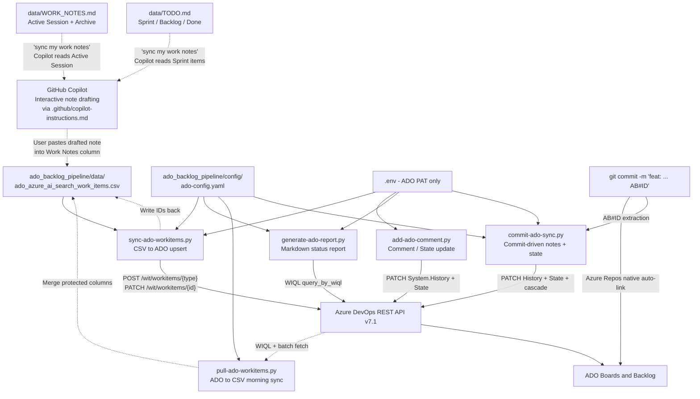
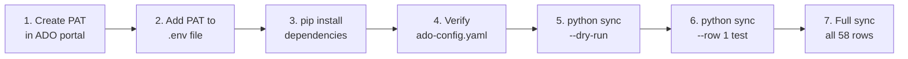
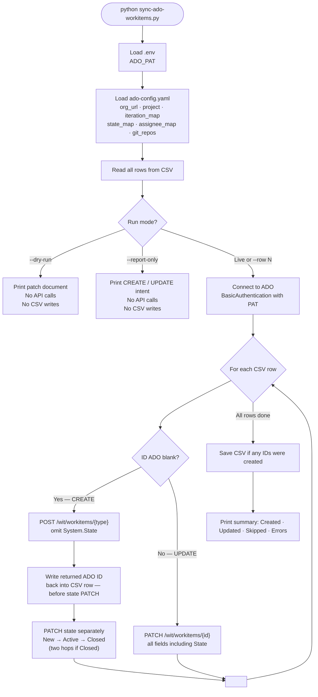
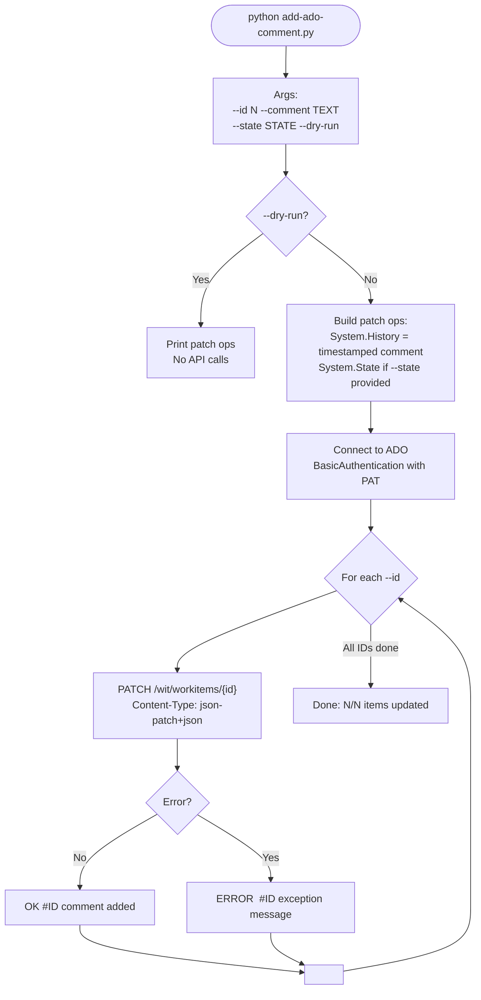
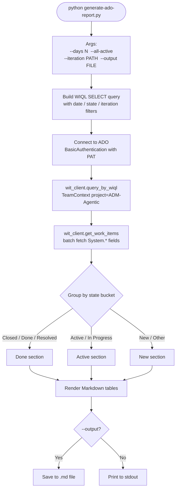
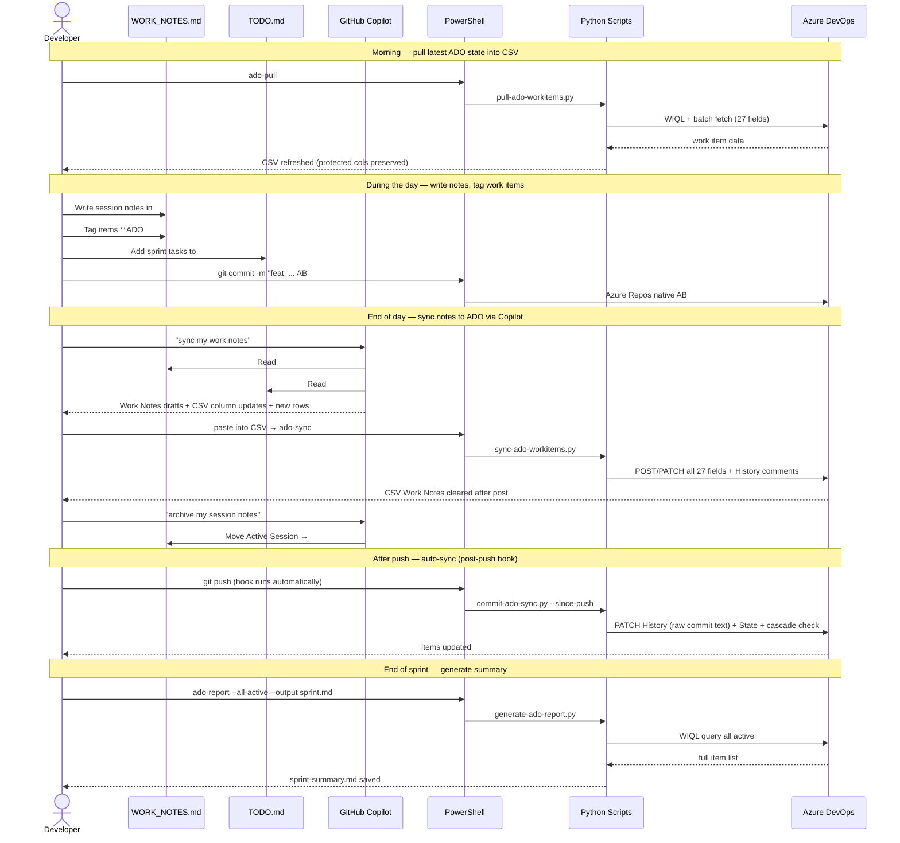
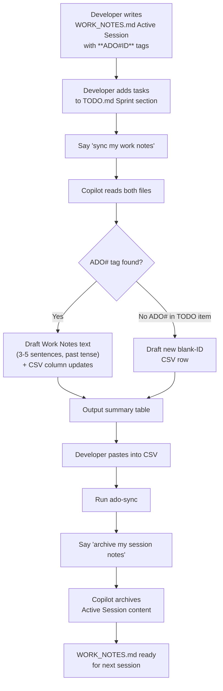
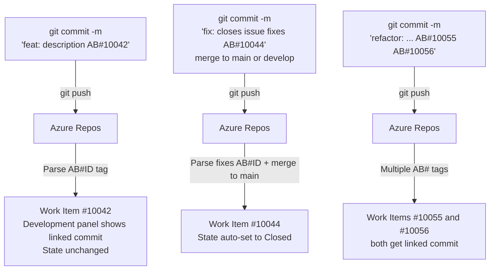

# 🔄 ADO Work Item Automation Pipeline

## Technical Guide — ADM-Agentic Project

**Author:** Hans Havlik  
**Last Updated:** 2026-02-27 (memory system added — WORK_NOTES.md + TODO.md as Copilot session scratch pad; new WORK_SESSION_SYNC_PROMPT.md; copilot-instructions.md updated with Memory System section and trigger phrases; Section 10a added)  
**Project:** ADM-Agentic (`https://dev.azure.com/ADM-Agentic/ADM-Agentic`)

---

## 📑 Table of Contents

1. [🏗️ Architecture Overview](#1-architecture-overview)
2. [🗂️ Repository Structure](#2-repository-structure)
3. [📦 Prerequisites](#3-prerequisites)
4. [☁️ Azure DevOps Configuration](#4-azure-devops-configuration)
5. [🔧 Local Environment Setup](#5-local-environment-setup)
6. [⚙️ Configuration Reference](#6-configuration-reference)
7. [🐍 Scripts Reference](#7-scripts-reference)
   - [7.1 sync-ado-workitems.py](#71-sync-ado-workitemspy)
   - [7.2 pull-ado-workitems.py](#72-pull-ado-workitemspy)
   - [7.3 commit-ado-sync.py](#73-commit-ado-syncpy)
   - [7.4 add-ado-comment.py](#74-add-ado-commentpy)
   - [7.5 generate-ado-report.py](#75-generate-ado-reportpy)
   - [7.6 install-git-hooks.py](#76-install-git-hookspy)
   - [7.7 set-priority.py](#77-set-prioritypy) _(new)_
8. [📋 Data Model — CSV to ADO Field Mapping](#8-data-model--csv-to-ado-field-mapping)
9. [🚀 Running the Initial Migration](#9-running-the-initial-migration)
10. [📅 Daily Workflow](#10-daily-workflow)
11. [🧠 Memory System — WORK_NOTES.md + TODO.md](#11-memory-system--work_notesmd--todomd)
12. [🌿 Commit Tagging Convention](#12-commit-tagging-convention)
13. [⚡ PowerShell Shortcuts](#13-powershell-shortcuts)
14. [🔍 Troubleshooting](#14-troubleshooting)
15. [👤 Setup for a New Team Member](#15-setup-for-a-new-team-member)

---

## 1. 🏗️ Architecture Overview

The pipeline connects a local CSV tracker to Azure DevOps using three Python scripts that call the ADO REST API directly — no Azure hosting or additional infrastructure required.

### System Architecture



### 🔗 Required Files per Script

Each script has a precise set of file dependencies. Use this table to confirm all required files are in place before running a script.

| File | Location | `sync` | `pull` | `commit-sync` | `add-comment` | `report` | `set-priority` |
|---|---|:---:|:---:|:---:|:---:|:---:|:---:|
| 🔐 `.env` | `ado_backlog_pipeline/.env` (canonical) | ✅ | ✅ | ✅ | ✅ | ✅ | ✗ |
| ⚙️ `ado-config.yaml` | `ado_backlog_pipeline/config/` | ✅ | ✅ | ✅ | ✗ | ✅ | ✅ |
| 📄 `ado_azure_ai_search_work_items.csv` | `ado_backlog_pipeline/data/` | ✅ | ✅ | ✗ | ✗ | ✗ | ✅ |

> **🔐 `.env` lookup order:** Scripts look for `ado_backlog_pipeline/.env` first — this is the canonical location. `GADM-WorkAssistant-BackEnd/.env` is a legacy fallback only.

### Setup Progress Flow



**Key design decisions:**

- **No cloud infrastructure required** — scripts run locally against the ADO REST API directly. No Azure Functions, no webhooks, no event triggers needed for the initial implementation.
- **CSV is the migration source of truth.** After the one-time migration, ADO becomes the living board and the CSV becomes a historical snapshot.
- **PAT authentication for local scripts.** The pipeline agent uses `$(System.AccessToken)` (built-in, no secret needed) for CI/CD steps.
- **All credentials stay in `.env`**, which is already `.gitignore`d — tokens are never committed.

---

## 2. 🗂️ Repository Structure

```
ADM-Agentic-Work-Assistant/
│
├── .github/
│   └── copilot-instructions.md          ← Auto-loaded by VS Code Copilot for all team members
│
├── ado_backlog_pipeline/              ← Self-contained automation bundle
│   ├── README.md                        ← Quick-start guide
│   ├── config/
│   │   └── ado-config.yaml              ← Central config (safe to commit)
│   ├── data/
│   │   ├── ado_azure_ai_search_work_items.csv   ← Canonical 27-column backlog CSV
│   │   ├── WORK_NOTES.md                ← 🧠 Copilot memory: technical session log (Active Session + Archive)
│   │   ├── TODO.md                      ← 📝 Sprint planning scratchpad (Sprint / Backlog / Done)
│   │   ├── work-log.csv.template        ← Personal daily log template (gitignored copy)
│   │   └── .gitignore                   ← Excludes work-log.csv
│   ├── docs/
│   │   └── ADO_AUTOMATION_PIPELINE_GUIDE.md    ← This file
│   ├── prompts/
│   │   ├── WORK_SESSION_SYNC_PROMPT.md  ← ⭐ PRIMARY: reads WORK_NOTES + TODO, drafts all CSV updates
│   │   ├── ADO_FULL_WORKITEM_PROMPT.md  ← Copilot prompt: full 27-column CSV row
│   │   ├── ADO_UPDATE_ONLY_PROMPT.md    ← Copilot prompt: targeted single-item update
│   │   └── COMMIT_MESSAGE_PROMPT.md     ← Copilot prompt: AB#ID commit messages
│   └── scripts/
│       ├── pull-ado-workitems.py        ← ADO → CSV morning sync
│       ├── sync-ado-workitems.py        ← CSV → ADO upsert (all 27 fields)
│       ├── commit-ado-sync.py           ← Commit-driven ADO notes + state
│       ├── add-ado-comment.py           ← Quick one-off comment + state
│       ├── generate-ado-report.py       ← WIQL → Markdown status report
│       ├── install-git-hooks.py         ← Install / remove post-push hook
│       └── set-priority.py              ← Fill blank Priority with type-based defaults
│
└── GADM-WorkAssistant-BackEnd/
    ├── .env                             ← Credentials (NEVER commit — already gitignored)
    └── requirements.txt                 ← Includes azure-devops, msrest, openai
```

> **Legacy files** at repo root (`ado-config.yaml`, `ado_azure_ai_search_work_items.csv`, `GADM-WorkAssistant-BackEnd/scripts/`) are superseded by the bundle. They are preserved for reference.

---

## 3. 📦 Prerequisites

### Software

| Tool | Version | Install |
|---|---|---|
| Python | 3.11+ | https://python.org |
| pip | Latest | bundled with Python |
| Azure CLI | Latest (optional) | `winget install Microsoft.AzureCLI` |

### Python Packages

These are included in `GADM-WorkAssistant-BackEnd/requirements.txt`:

```
azure-devops==7.1.0b4
msrest>=0.7.1
azure-identity==1.23.0
python-dotenv==1.0.1
PyYAML==6.0.1
```

Install with:

```powershell
pip install azure-devops msrest python-dotenv pyyaml
```

> No Azure OpenAI dependency is required. GitHub Copilot (running in VS Code) handles all AI-assisted note drafting interactively. The scripts are pure ADO REST API plumbing.

### Access Requirements

- Member of the **ADM-Agentic** Azure DevOps organization (`https://dev.azure.com/ADM-Agentic`)
- Access level: **Basic** or higher (Stakeholder does not grant full work item write access)
- A **Personal Access Token (PAT)** — see Section 4

---

## 4. ☁️ Azure DevOps Configuration

### 4.1 Create a Personal Access Token (PAT)

> Each team member must create their own PAT — tokens are personal and must not be shared.

1. Navigate to: `https://dev.azure.com/ADM-Agentic/_usersSettings/tokens`
2. Click **New Token**
3. Fill in the form:

   | Field | Value |
   |---|---|
   | **Name** | `ado-automation` |
   | **Organization** | `ADM-Agentic` |
   | **Expiration** | 90 days (recommended) or 1 year |
   | **Scopes** | Custom defined |
   | **Work Items** | ✅ Read, write & manage |
   | All other scopes | Leave unchecked |

4. Click **Create** and **copy the token immediately** — it is only shown once.

> **Token rotation:** When your PAT expires, repeat these steps and update the value in your `.env` file.

### 4.2 Enable Work Item → Commit Auto-Linking

This is a one-time project-level setting. A project administrator needs to enable it once.

1. Navigate to: `https://dev.azure.com/ADM-Agentic/ADM-Agentic/_settings/repositories`
2. Under **Settings**, toggle **"Resolve work items on commit"** → **On**

This enables `AB#<ID>` tags in commit messages to automatically link commits to work items (see Section 11).

### 4.3 Project Reference Information

| Property | Value |
|---|---|
| **Organization URL** | `https://dev.azure.com/ADM-Agentic` |
| **Project** | `ADM-Agentic` |
| **Process template** | ADM-Agentic Agile (custom Agile) |
| **Work item types** | `Epic`, `Feature`, `User Story`, `Task` |
| **Current iteration** | `ADM-Agentic\Iteration 9` (2/25/2026 – 3/10/2026) |

### 4.4 Iteration Path Reference

| Iteration | Full ADO Path | Dates |
|---|---|---|
| Iteration 1 | `ADM-Agentic\Iteration 1` | 11/5/2025 – 11/18/2025 |
| Iteration 2 | `ADM-Agentic\Iteration 2` | 11/19/2025 – 12/2/2025 |
| Iteration 3 | `ADM-Agentic\Iteration 3` | 12/3/2025 – 12/16/2025 |
| Iteration 4 | `ADM-Agentic\Iteration 4` | 12/17/2025 – 12/30/2025 |
| Iteration 5 | `ADM-Agentic\Iteration 5` | 12/31/2025 – 1/13/2026 |
| Iteration 6 | `ADM-Agentic\Iteration 6` | 1/14/2026 – 1/27/2026 |
| Iteration 7 | `ADM-Agentic\Iteration 7` | 1/28/2026 – 2/10/2026 |
| Iteration 8 | `ADM-Agentic\Iteration 8` | 2/11/2026 – 2/24/2026 |
| Iteration 9 | `ADM-Agentic\Iteration 9` | 2/25/2026 – 3/10/2026 |
| Iteration 10 | `ADM-Agentic\Iteration 10` | 3/11/2026 – 3/24/2026 |

**Note:** The CSV uses shorthand values (`8a`, `8b`) which are mapped to the correct ADO iteration paths in `ado-config.yaml`. New iterations should be added to the `iteration_map` in that file.

---

## 5. 🔧 Local Environment Setup

### Step 1 — Clone / pull the repository

```powershell
git clone https://ADM-Agentic@dev.azure.com/ADM-Agentic/ADM-Agentic/_git/<repo-name>
```

### Step 2 — Install dependencies

```powershell
cd GADM-WorkAssistant-BackEnd
pip install azure-devops msrest python-dotenv pyyaml openai
```

Or install the full requirements file:

```powershell
pip install -r requirements.txt
```

### Step 3 — 🔐 Create your `.env` file

Copy the template and fill in your values — it lives inside the bundle so credentials stay isolated from application code branches:

```powershell
copy ado_backlog_pipeline\.env.example ado_backlog_pipeline\.env
```

Then open `ado_backlog_pipeline/.env` and set:

```dotenv
ADO_PAT=your_personal_access_token_here
```

> This is the only credential required. `ADO_ORG_URL` and `ADO_PROJECT` are read from `ado-config.yaml`.
> No Azure OpenAI key is needed — GitHub Copilot handles all AI-assisted drafting interactively in VS Code.

### Step 3b — Install the post-push hook and PowerShell aliases

```powershell
cd ADM-Agentic-Work-Assistant
python ado_backlog_pipeline\scripts\install-git-hooks.py
```

This installs the git hook and prints the PowerShell `$PROFILE` alias block to copy.

### Step 4 — Verify setup

Run the morning pull dry-run to confirm everything is wired correctly:

```powershell
python ado_backlog_pipeline\scripts\pull-ado-workitems.py --dry-run
```

Then verify the push path:

```powershell
python ado_backlog_pipeline\scripts\sync-ado-workitems.py --dry-run
```

Expected output:

```
[INFO] 58 rows found in CSV  |  DRY-RUN mode

  [DRY-RUN]  Row   1  [Epic]  GADM Work Assistant Azure AI Search Integration
               add     /fields/System.Title          GADM Work Assistant Azure AI Search Integr...
               add     /fields/System.Description    Migrate recommendation retrieval and histor...
               add     /fields/System.State          In Progress
               add     /fields/System.IterationPath  ADM-Agentic\Iteration 8
               add     /fields/System.AssignedTo     hans.havlik@capgemini.com
               add     /fields/System.Tags           csv-sync; adm-agentic
  ...

============================================================
  Completed : 2026-02-19 14:32:00
  Created   : 0
  Updated   : 0
  Skipped   : 0
  Errors    : 0
============================================================
```

If you see `ADO_PAT is not set` — double-check the `.env` file path and that the three ADO keys are present.

---

## 6. ⚙️ Configuration Reference

### `ado-config.yaml`

Located at `ado_backlog_pipeline/config/ado-config.yaml`. Safe to commit — contains no credentials.

Key sections:

```yaml
ado:
  org_url: https://dev.azure.com/ADM-Agentic
  project: ADM-Agentic

# Relative to ado_backlog_pipeline/ bundle root
csv_path: data/ado_azure_ai_search_work_items.csv

# CSV Iteration # shorthand → full ADO iteration path
iteration_map:
  "8a": "ADM-Agentic\\Iteration 8"
  "8b": "ADM-Agentic\\Iteration 9"
  "9":  "ADM-Agentic\\Iteration 9"
  "10": "ADM-Agentic\\Iteration 10"
  "11": "ADM-Agentic\\Iteration 11"

# Display name → ADO email (System.AssignedTo field)
assignee_map:
  "Hans Havlik": "hans.havlik@capgemini.com"

# Columns never overwritten by pull-ado-workitems.py
pull:
  protected_columns:
    - Work Notes
    - Owner
    - Dev Lead
    - In scope for DEMO or MVP Release?
    - Branch Name
    - Branch Repo

# Git repo short names → ADO repo names (for branch linking)
git_repos:
  backend:   "GADM-WorkAssistant-BackEnd"
  frontend:  "GADM-WorkAssistant-FrontEnd"
  selfheal:  "Selfhealagent-Backend"

# commit-ado-sync.py configuration
commit_sync:
  state_keywords: [fixes, closes, resolves, completes, done, merged]
  cascade_enabled: true
  default_commit_lookback: 10

# Type-based default Priority for set-priority.py
# Only fills blank cells — existing values are never overwritten
priority_defaults:
  default: 2
  by_type:
    Epic:         1   # Critical
    Feature:      2   # High
    "User Story": 2   # High
    Task:         2   # High
    Bug:          1   # Critical
    "Test Case":  3   # Medium
    "Test Plan":  3   # Medium
```

**To add a new team member**, add their entry to `assignee_map` in `ado-config.yaml` and commit it to `main` so all developers get the updated mapping.

**To add a new iteration**, append it to `iteration_map` — never modify existing entries.

---

## 7. 🐍 Scripts Reference

All scripts live in `ado_backlog_pipeline/scripts/` and load credentials from `ado_backlog_pipeline/.env` (canonical). `GADM-WorkAssistant-BackEnd/.env` is a legacy fallback.

---

### 7.1 📤 `sync-ado-workitems.py`

**Purpose:** One-time CSV migration and ongoing upsert. Reads `ado_azure_ai_search_work_items.csv` and creates or updates each row as a work item in ADO.

**Required files:** `.env`, `ado-config.yaml`, `ado_azure_ai_search_work_items.csv`

#### Execution Flow



#### Fields Written per Work Item

| CSV Column | ADO Field Path | Transformation |
|---|---|---|
| `Title` | `System.Title` | Direct |
| `Description` + `Comments` + `Blocker/Dependency` | `System.Description` | Merged as HTML |
| `Work Notes` | `System.History` | Posted as comment; cell cleared after push |
| `State (ADO)` | `System.State` | Mapped via `state_map` in `ado-config.yaml` |
| `Iteration #` | `System.IterationPath` | Mapped via `iteration_map` in `ado-config.yaml` |
| `Assigned To (ADO)` | `System.AssignedTo` | Mapped via `assignee_map` in `ado-config.yaml` |
| `Priority` | `Microsoft.VSTS.Common.Priority` | 1–4 |
| `Start (MM/DD/YYYY)` | `Microsoft.VSTS.Scheduling.StartDate` | MM/DD/YYYY → ISO 8601 |
| `End (MM/DD/YYYY)` | `Microsoft.VSTS.Scheduling.TargetDate` | MM/DD/YYYY → ISO 8601 |
| `Effort` | `Microsoft.VSTS.Scheduling.Effort` | Epic / Feature only |
| `Story Points` | `Microsoft.VSTS.Scheduling.StoryPoints` | User Story / Task only |
| `Business Value` | `Microsoft.VSTS.Common.BusinessValue` | 1–500 |
| `Time Criticality` | `Microsoft.VSTS.Common.TimeCriticality` | 1–20 |
| `Parent ID (ADO)` | `System.LinkTypes.Hierarchy-Reverse` | Idempotent relation patch |
| `Branch Name` + `Branch Repo` | `ArtifactLink` | Idempotent branch link via Git client |
| _(auto)_ | `System.Tags` | `auto_tags` merged with item-level tags; adds `mvp-scope` if in-scope |

#### Usage

```powershell
# Recommended first run — validate without writing anything
python ado_backlog_pipeline\scripts\sync-ado-workitems.py --dry-run

# Show CREATE/UPDATE intent for each row (no API calls)
python ado_backlog_pipeline\scripts\sync-ado-workitems.py --report-only

# Sync a single row by row number (1-based, excluding header)
python ado_backlog_pipeline\scripts\sync-ado-workitems.py --row 3

# Skip parent/branch relation linking (faster for state/comment-only updates)
python ado_backlog_pipeline\scripts\sync-ado-workitems.py --no-relations

# Apply parent and branch links only — no field updates or creates
# Useful for retroactively linking existing ADO items after filling Parent ID / Branch Name in CSV
python ado_backlog_pipeline\scripts\sync-ado-workitems.py --relations-only

# Preview what would be linked without writing to ADO
python ado_backlog_pipeline\scripts\sync-ado-workitems.py --relations-only --dry-run

# Full live sync — creates/updates all rows, writes IDs back to CSV
python ado_backlog_pipeline\scripts\sync-ado-workitems.py
```

**Output example (live sync):**

```
[INFO] Connected to https://dev.azure.com/ADM-Agentic / ADM-Agentic
[INFO] 58 rows found in CSV  |  LIVE mode

  [CREATED]  Row   1  #10042   [Epic]         GADM Work Assistant Azure AI Search Integration
  [CREATED]  Row   2  #10043   [Feature]      Recommendation Engine Azure AI Search Cutover
  [CREATED]  Row   3  #10044   [User Story]   Cut over recommendation retrieval to Azure AI...
  ...

[INFO] CSV updated — 58 new ADO IDs written back → ado_azure_ai_search_work_items.csv

============================================================
  Completed : 2026-02-19 14:45:00
  Created   : 58
  Updated   : 0
  Skipped   : 0
  Errors    : 0
============================================================
```

---

### 7.2 ☀️ `pull-ado-workitems.py`

**Purpose:** Bidirectional pull — refreshes the local CSV from ADO each morning. Preserves protected columns (`Work Notes`, `Owner`, `Dev Lead`, `Branch Name`, `Branch Repo`, `In scope for DEMO or MVP Release?`) so your intraday edits are never overwritten.

**Required files:** `.env`, `ado-config.yaml`

#### Key behaviour

- Queries ADO via WIQL, batch-fetches all 27-column fields in one call
- Merges new ADO data into existing CSV rows (matched by `ID (ADO)`)
- Appends genuinely new items not yet in the CSV
- Old 15-column CSV headers are expanded to the full 27-column schema on first run (automatic migration)
- `Last Synced (ADO)` column is updated on every pull

#### Usage

```powershell
# Pull items assigned to you in the current iteration (default)
python ado_backlog_pipeline\scripts\pull-ado-workitems.py

# Pull all active items in the project
python ado_backlog_pipeline\scripts\pull-ado-workitems.py --all

# Pull specific items by ID
python ado_backlog_pipeline\scripts\pull-ado-workitems.py --ids 1579 1580

# Pull items updated since a specific date
python ado_backlog_pipeline\scripts\pull-ado-workitems.py --since 2026-02-01

# Preview — print changes without writing the CSV file
python ado_backlog_pipeline\scripts\pull-ado-workitems.py --dry-run

# Also overwrite Work Notes column (normally protected)
python ado_backlog_pipeline\scripts\pull-ado-workitems.py --overwrite-notes
```

---

### 7.3 🤖 `commit-ado-sync.py`

**Purpose:** Reads recent git commits, extracts `AB#ID` references, posts the commit text as a work note, and infers state changes to ADO. Automatically run as a post-push git hook when installed via `install-git-hooks.py`.

> **AI note drafting** is handled interactively by **GitHub Copilot** in VS Code — ask it to draft notes before committing and paste them into the `Work Notes` column. This script handles the ADO API write after you push.

**Required files:** `.env`, `ado-config.yaml`

#### Key behaviour

- Detects commits since last push (`git log @{u}..HEAD`); falls back to last N commits
- Extracts all `AB#<ID>` references (case-insensitive) from commit subject + body
- Infers `Closed` state when `fixes|closes|resolves|completes|done|merged` precedes `AB#ID`
- Transitions `New → Active` for any referenced item that is not yet being closed
- Posts raw commit text to `System.History` as the work note
- Cascade: after marking Tasks Closed, checks if all sibling Tasks are closed → auto-closes parent User Story; same logic up to Feature level
- Two-hop state safety: `New → Active → Closed` to avoid ADO 400 errors

#### Usage

```powershell
# Process commits since last push (default — same as post-push hook)
python ado_backlog_pipeline\scripts\commit-ado-sync.py

# Preview all actions without writing to ADO
python ado_backlog_pipeline\scripts\commit-ado-sync.py --dry-run

# Last N commits instead of since-push
python ado_backlog_pipeline\scripts\commit-ado-sync.py --commits 5

# Target specific ADO IDs (skip commit parsing)
python ado_backlog_pipeline\scripts\commit-ado-sync.py --ids 1579 1580

# Skip posting commit text — only update state, no System.History comment
python ado_backlog_pipeline\scripts\commit-ado-sync.py --state-only

# Skip parent cascade auto-close
python ado_backlog_pipeline\scripts\commit-ado-sync.py --no-cascade

# Override inferred state
python ado_backlog_pipeline\scripts\commit-ado-sync.py --force-state Closed
```

---

### 7.4 💬 `add-ado-comment.py`

**Purpose:** Quick comment or state update on individual work items by ADO ID. Ideal for daily progress notes and closing items without opening the ADO board UI.

**Required files:** `.env` only

#### Execution Flow



#### Usage

```powershell
# Add a comment to a single item
python ado_backlog_pipeline\scripts\add-ado-comment.py --id 10042 --comment "Vectorizer profile update applied"

# Add the same comment to multiple items at once
python ado_backlog_pipeline\scripts\add-ado-comment.py --id 10042 --id 10043 --comment "Sprint 9 review complete"

# Add a comment and update the state simultaneously
python ado_backlog_pipeline\scripts\add-ado-comment.py --id 10044 --comment "Merged to main" --state Closed

# Dry-run — print patch document without calling ADO
python ado_backlog_pipeline\scripts\add-ado-comment.py --id 10042 --comment "Test" --dry-run
```

**Supported state values (ADM-Agentic Agile process):**

| Type | Valid states |
|---|---|
| Epic | `New`, `Active`, `Resolved`, `Closed`, `Removed` |
| Feature | `New`, `Active`, `Resolved`, `Closed`, `Removed` |
| User Story | `New`, `Active`, `Resolved`, `Closed`, `Removed` |
| Task | `New`, `Active`, `Closed`, `Removed` |

> **Note:** `Task` does not have a `Resolved` state. Use `Active` (not `In Progress`) as the in-flight state — `In Progress` is not a valid ADO state name for any work item type in this project.

---

### 7.5 📊 `generate-ado-report.py`

**Purpose:** WIQL-based Markdown status report. Queries ADO and renders work items grouped by state — useful for standup notes, sprint summaries, and end-of-day logging.

**Required files:** `.env` only

#### Execution Flow



#### Usage

```powershell
# Today's items (changed in last 24 hours) — print to stdout
python ado_backlog_pipeline\scripts\generate-ado-report.py

# Last 7 days — save to file
python ado_backlog_pipeline\scripts\generate-ado-report.py --days 7 --output sprint-summary.md

# All currently active items in Iteration 9 — print to stdout
python ado_backlog_pipeline\scripts\generate-ado-report.py --all-active --iteration "ADM-Agentic\Iteration 9"

# All active items — save to dated file
python ado_backlog_pipeline\scripts\generate-ado-report.py --all-active --output "DAILY_REPORT_$(Get-Date -Format yyyy-MM-dd).md"
```

---

### 7.6 🪝 `install-git-hooks.py`

**Purpose:** Installs a `.git/hooks/post-push` script that automatically runs `commit-ado-sync.py` after every `git push`. Also prints PowerShell `$PROFILE` alias definitions for the `ado-*` shorthand commands.

```powershell
# Install the post-push hook
python ado_backlog_pipeline\scripts\install-git-hooks.py

# Remove the hook
python ado_backlog_pipeline\scripts\install-git-hooks.py --remove

# Show current hook status + print PowerShell alias block
python ado_backlog_pipeline\scripts\install-git-hooks.py --status
```

> **Windows note:** Git hooks require Git Bash or Git for Windows. If you use PowerShell as your primary terminal, use the printed `$PROFILE` aliases instead of relying on the hook.

**Sample output:**

```markdown
# ADO Work Item Status Report
**Generated:** 2026-02-19 14:50 UTC   **Project:** ADM-Agentic

## ✅ Done / Closed (32)
| ID | Type | Title | State | Iteration |
|---|---|---|---|---|
| [#10044](https://dev.azure.com/...) | User Story | Cut over recommendation retrieval... | Closed | Iteration 8 |

## 🔄 Active / In Progress (22)
| ID | Type | Title | State | Iteration |
|---|---|---|---|---|
| [#10042](https://dev.azure.com/...) | Epic | GADM Work Assistant Azure AI Search... | In Progress | Iteration 8 |

## ⏳ New / Other (4)
...
```

---

### 7.7 🎯 `set-priority.py` _(new)_

**Purpose:** Scan the backlog CSV and fill any blank `Priority` cells using type-based defaults defined in `ado-config.yaml` (`priority_defaults` section). Only fills **blank** cells — existing values are never overwritten. Run after adding new work items, before syncing to ADO.

**Required files:** `ado-config.yaml`, `ado_azure_ai_search_work_items.csv`

#### Priority scale

| Value | Meaning | Default work item types |
|---|---|---|
| 1 | Critical | `Epic`, `Bug` |
| 2 | High | `Feature`, `User Story`, `Task` |
| 3 | Medium | `Test Case`, `Test Plan` |
| 4 | Low | _(not defaulted)_ |

#### Usage

```powershell
# Fill all blank Priority cells (open items only — default)
python ado_backlog_pipeline\scripts\set-priority.py

# Preview what would change — no file write
python ado_backlog_pipeline\scripts\set-priority.py --dry-run

# List all items with no priority set — no changes made
python ado_backlog_pipeline\scripts\set-priority.py --report

# Include closed/done items as well
python ado_backlog_pipeline\scripts\set-priority.py --all

# Scope to specific ADO IDs only
python ado_backlog_pipeline\scripts\set-priority.py --ids 1601 1607 1608

# Scope to one work item type only
python ado_backlog_pipeline\scripts\set-priority.py --type Task
```

After running, push the updated Priority values to ADO with `ado-sync`.

#### New Items Workflow

```powershell
ado-pull                                          # 1. pull any new items from ADO
python scripts/set-priority.py --dry-run          # 2. preview defaults for blank Priority cells
python scripts/set-priority.py                    # 3. apply defaults
ado-sync                                          # 4. push updated Priority to ADO
```

> **To change the defaults** for a work item type, edit `priority_defaults.by_type` in `ado-config.yaml` — no code changes are needed.

---

## 8. 📋 Data Model — CSV to ADO Field Mapping

The canonical CSV has **27 columns**. All columns are bidirectional (ADO → CSV on pull; CSV → ADO on sync).

| CSV Column | ADO Field | Sync Direction | Notes |
|---|---|:---:|---|
| `ID (ADO)` | `System.Id` | ← pull | Blank on create; written back after creation |
| `Type` | Work item type (`$type` in URL) | ← pull | `Epic`, `Feature`, `User Story`, `Task` |
| `Parent ID (ADO)` | `System.LinkTypes.Hierarchy-Reverse` | ↔ both | Idempotent relation patch on sync |
| `Title` | `System.Title` | ↔ both | Required |
| `Description` | `System.Description` | ↔ both | HTML stripped on pull |
| `Blocker/Dependency` | Appended to `System.Description` | → sync | Rendered as "Blocker / Dependency" section |
| `Comments` | Appended to `System.Description` | → sync | Rendered as "Comments / Evidence" section |
| `Work Notes` | `System.History` | → sync | **Protected** scratchpad; posted as comment then cleared |
| `Assigned To (ADO)` | `System.AssignedTo` | ↔ both | Resolved via `assignee_map` |
| `Owner` | _(local only)_ | **Protected** | Never overwritten on pull |
| `Dev Lead` | _(local only)_ | **Protected** | Never overwritten on pull |
| `State (ADO)` | `System.State` | ↔ both | Mapped via `state_map` |
| `Status` | _(derived)_ | ← pull | Not Started / In Progress / Completed / Blocked |
| `Priority` | `Microsoft.VSTS.Common.Priority` | ↔ both | 1–4 |
| `Iteration #` | `System.IterationPath` | ↔ both | Mapped via `iteration_map` in `ado-config.yaml` |
| `Area Path` | `System.AreaPath` | ↔ both | |
| `Start (MM/DD/YYYY)` | `Microsoft.VSTS.Scheduling.StartDate` | ↔ both | MM/DD/YYYY |
| `End (MM/DD/YYYY)` | `Microsoft.VSTS.Scheduling.TargetDate` | ↔ both | MM/DD/YYYY |
| `Effort` | `Microsoft.VSTS.Scheduling.Effort` | ↔ both | Epic / Feature; Fibonacci |
| `Story Points` | `Microsoft.VSTS.Scheduling.StoryPoints` | ↔ both | User Story / Task; Fibonacci |
| `Business Value` | `Microsoft.VSTS.Common.BusinessValue` | ↔ both | 1–500 |
| `Time Criticality` | `Microsoft.VSTS.Common.TimeCriticality` | ↔ both | 1–20 |
| `Tags` | `System.Tags` | ↔ both | Merged with `auto_tags`; `mvp-scope` added if in-scope |
| `In scope for DEMO or MVP Release?` | _(local only)_ | **Protected** | YES / NO / TBD |
| `Branch Name` | `ArtifactLink` | → sync | **Protected**; linked as branch artifact |
| `Branch Repo` | `ArtifactLink` | → sync | **Protected**; `backend` / `frontend` / `selfheal` |
| `Last Synced (ADO)` | _(script-managed)_ | ← pull | Set on each pull; do not edit manually |

---

## 9. 🚀 Running the Initial Migration

> **Migration status: COMPLETE (2026-02-19)**
> All 58 work items were upserted to ADO. Every `ID (ADO)` cell in the CSV is now populated.
> ADO is the living board. The steps below are preserved for reference and for future re-migrations.

### Migrated ADO Item Inventory

| ADO IDs | Type | Count |
|---|---|---|
| #1534, #1569 | Epics | 2 |
| #1560, #1564, #1570, #1572, #1575 | Features | 5 |
| #1561–#1568, #1571, #1573–#1574, #1576–#1577 | User Stories | 11 |
| #1579–#1617 | Tasks | 39 |

**Final sync result:** `Created: 0 | Updated: 58 | Skipped: 0 | Errors: 0`

> ⚠️ **Pending manual action:** Delete test Task **#1578** ("[TEST] delete me") at
> `https://dev.azure.com/ADM-Agentic/ADM-Agentic/_workitems/edit/1578` → `...` → Delete.
> This item was created during debugging and has no corresponding CSV row.

---

> This is a one-time operation. After it completes, the CSV becomes a historical snapshot and ADO is the living board.

### Step 1 — Dry-run validation

```powershell
python ado_backlog_pipeline\scripts\sync-ado-workitems.py --dry-run
```

Review the output. Verify:
- Iteration paths show `ADM-Agentic\Iteration 8` or `ADM-Agentic\Iteration 9` (not the raw shorthand `8a`/`8b`)
- States show `Closed`, `Active`, or `New` (not raw CSV values)
- Assignee shows the full email address
- Planning fields (Priority, Start, End) appear in the patch document

### Step 2 — Test with a single row

```powershell
python ado_backlog_pipeline\scripts\sync-ado-workitems.py --row 1
```

Navigate to ADO Boards and confirm the Epic was created correctly.

### Step 3 — Full sync

```powershell
python ado_backlog_pipeline\scripts\sync-ado-workitems.py
```

After completion:
- The CSV will have all `ID (ADO)` cells populated with real ADO IDs.
- All 58 work items will be visible on the ADO board under their correct iterations.

### Step 4 — Verify in ADO

Navigate to: `https://dev.azure.com/ADM-Agentic/ADM-Agentic/_boards`

Confirm items appear with correct titles, states, and iteration assignments.

---

## 10. 📅 Daily Workflow

After the initial migration, the recommended daily workflow is:

### End-to-End Daily Sequence



### Starting the day

```powershell
# Pull latest ADO state into your CSV
ado-pull
# or: python ado_backlog_pipeline\scripts\pull-ado-workitems.py
```

Or browse directly: `https://dev.azure.com/ADM-Agentic/ADM-Agentic/_boards`

### During work — writing session notes

1. Open `ado_backlog_pipeline/data/WORK_NOTES.md`
2. Write technical notes freely under `## Active Session`
3. Tag any work item you touched with `**ADO#<ID>**` — e.g., `**ADO#1579**`
4. Add new tasks to `ado_backlog_pipeline/data/TODO.md` under `## Sprint / This Week`
5. Include `AB#<ID>` in every commit message (see Section 12)

### End of day — syncing notes to ADO via Copilot

Say `"sync my work notes"` in Copilot Chat. Copilot reads both memory files and produces:
- Work Notes text for each `**ADO#ID**` item (ready to paste into the CSV `Work Notes` column)
- CSV column updates (State, Status, Story Points, dates, etc.)
- New blank-ID CSV rows for any TODO without an `ADO#ID`

Then: paste into CSV → `ado-sync` → say `"archive my session notes"`.

See Section 11 for the full Memory System reference.

### After adding new work items

```powershell
ado-pull                                                   # refresh CSV from ADO
python ado_backlog_pipeline\scripts\set-priority.py --dry-run  # preview gaps
python ado_backlog_pipeline\scripts\set-priority.py            # fill blank Priority cells
ado-sync                                                   # push to ADO
```

### End of sprint — generate summary

```powershell
python ado_backlog_pipeline\scripts\generate-ado-report.py --all-active --iteration "ADM-Agentic\Iteration 9" --output "sprint9-summary.md"
```

---

## 11. 🧠 Memory System — WORK_NOTES.md + TODO.md

The memory system gives Copilot persistent knowledge of what was built and what is planned, so it can draft professional ADO updates without asking the developer to re-describe their work.

### Architecture

```
Developer writes               Copilot reads                ADO updated
────────────────               ─────────────             ───────────
WORK_NOTES.md ───────────┬───────────────┬────→ System.History
  ## Active Session            │ "sync my work      │     (Work Notes col)
    **ADO#1579** <notes>       │  notes" trigger    │
TODO.md ─────────────────┯───────────────┘────→ New work items
  ## Sprint / This Week                                    (blank-ID CSV rows)
    - [ ] <task> | ADO#1580
```

### WORK_NOTES.md — Technical Session Log

**File:** `ado_backlog_pipeline/data/WORK_NOTES.md`

| Section | Purpose | Modified by |
|---|---|---|
| `## Active Session` | Freeform technical notes for the current session. Tag work items with `**ADO#<ID>**`. | Developer (and Copilot on archive trigger) |
| `## Archive` | Dated sub-sections of past sessions. Used by Copilot for historical context only. | Copilot (on `"archive my session notes"` trigger) |

**Tagging syntax:**
```markdown
## Active Session

**ADO#1579** — Rewrote synthesis prompt to pre-build table sections deterministically.
Removed reliance on GroupChat; replaced with `_build_synthesis_output()` pure-Python method.

**ADO#1580, ADO#1581** — ServiceNow `sysparm_display_value=all` added to both fetch methods.
```

**Archive trigger:** Say `"archive my session notes"` — Copilot moves the `## Active Session` body to:
```markdown
## Archive

### YYYY-MM-DD — <brief title derived from notes>
<session content moved here>
```
...then leaves `## Active Session` blank and ready for the next session.

### TODO.md — Sprint Planning

**File:** `ado_backlog_pipeline/data/TODO.md`

| Section | Purpose |
|---|---|
| `## 🔴 Sprint / This Week` | Active sprint items. Items without `ADO#ID` are flagged by Copilot for new CSV rows. |
| `## 🟡 Backlog / Soon` | Future sprint items. |
| `## ✅ Done` | Completed items — move here at sprint end. |

**Item syntax:**
```markdown
- [ ] Implement cosine threshold filter for retrieval  |  Type: Task  |  Priority: 2  |  ADO#1579
- [ ] Write integration tests for synthesis pipeline   |  Type: Task  |  Priority: 2
```

TODO.md is **planning scratch only** — Copilot never auto-creates ADO work items without an explicit request.

### Trigger Phrases Reference

| Phrase | What Copilot does | Prompt file used |
|---|---|---|
| `"sync my work notes"` | Reads WORK_NOTES Active Session + TODO Sprint; drafts Work Notes text + CSV updates for each ADO# item; drafts new rows for untracked TODOs; prints summary table | `WORK_SESSION_SYNC_PROMPT.md` |
| `"update ADO from my notes"` | Same as above | `WORK_SESSION_SYNC_PROMPT.md` |
| `"archive my session notes"` | Moves Active Session to `## Archive > ### YYYY-MM-DD` and clears the section | _(built-in to instructions)_ |
| `"log my work today on #1579"` | Targeted single-item update using WORK_NOTES context | `ADO_UPDATE_ONLY_PROMPT.md` |
| `"create a work item for <topic>"` | Full 27-column CSV row; uses TODO.md as context | `ADO_FULL_WORKITEM_PROMPT.md` |
| `"draft a commit message for #1579"` | Conventional Commits + AB#ID format | `COMMIT_MESSAGE_PROMPT.md` |

### Session Sync Workflow (step by step)



### Notes on CSV Work Notes vs WORK_NOTES.md

| | CSV `Work Notes` column | `WORK_NOTES.md` |
|---|---|---|
| **Purpose** | Holds the text to be posted to ADO as a comment | Holds the raw developer-written technical session notes |
| **Modified by** | Developer pastes text here; script clears it after posting | Developer writing; Copilot archives on trigger |
| **Lifetime** | Cleared after each `ado-sync` | Permanent (Active Session replaced; Archive grows) |
| **Seen in ADO** | Yes — appears in work item Discussion panel | No — local only |

---

## 12. 🌿 Commit Tagging Convention

Azure DevOps natively recognizes `AB#<work-item-id>` in commit messages and pull request descriptions, automatically linking the commit to the work item's Development panel — no code required.

### Commit → ADO Link Flow



> **Prerequisite:** The "Resolve work items on commit" setting must be enabled in ADO project settings (see Section 4.2).

### Basic linking (any branch)

```
git commit -m "feat: implement vectorizer profile binding AB#10042"
```

This links the commit to work item `#10042`. The work item state is **not** changed.

### Resolve on merge (merge to `main` or `develop`)

```
git commit -m "fix: closes vectorizer path failure fixes AB#10044"
```

When this commit reaches `main` or `develop`, ADO automatically transitions work item `#10044` to the configured "Done" state.

### Multiple items in one commit

```
git commit -m "refactor: unify notification sender AB#10055 AB#10056"
```

### Conventions for this project

| Branch type | Commit convention | ADO effect |
|---|---|---|
| `feature/*` | `feat: description AB#ID` | Links commit, no state change |
| `develop` | `fix: description fixes AB#ID` | Links commit, may auto-close |
| `main` | Merge commit (PR title includes `AB#ID`) | Auto-closes linked items |

> **Important:** The "Resolve work items on commit" setting in ADO must be enabled for auto-close to work (see Section 4.2). A project administrator needs to enable this once.

---

## 13. ⚡ PowerShell Shortcuts

A PowerShell profile provides global `ado-*` aliases callable from any repository directory without navigating to the scripts folder.

### Installation

The profile file is located at:

```
C:\Users\hhavlik\OneDrive - Capgemini\Documents\WindowsPowerShell\Microsoft.PowerShell_profile.ps1
```

To reload the profile without restarting PowerShell:

```powershell
. $PROFILE
```

### Available Commands

| Command | Maps to | Description |
|---|---|---|
| `ado-sync [args]` | `sync-ado-workitems.py` | CSV → ADO upsert |
| `ado-comment [args]` | `add-ado-comment.py` | Add comment / update state |
| `ado-report [args]` | `generate-ado-report.py` | Generate Markdown status report |

All arguments are passed through directly:

```powershell
# Works from any repo directory
ado-sync --dry-run
ado-sync --row 1
ado-sync

ado-comment --id 10042 --comment "Done" --state Closed
ado-comment --id 10042 --id 10043 --comment "Sprint review complete"

ado-report
ado-report --days 7
ado-report --all-active --output sprint-summary.md
```

### Profile Function Definition

Each function resolves the script path absolutely so it works regardless of the current working directory:

```powershell
$ADO_SCRIPTS = "C:\Users\hhavlik\OneDrive - Capgemini\Desktop\Azure DevOps Projects\
MAF_Agentic_Orchestration_Application\ADM-Agentic-Work-Assistant\GADM-WorkAssistant-BackEnd\scripts"

function ado-sync   { python "$ADO_SCRIPTS\sync-ado-workitems.py"  @args }
function ado-comment { python "$ADO_SCRIPTS\add-ado-comment.py"    @args }
function ado-report  { python "$ADO_SCRIPTS\generate-ado-report.py" @args }
```

### For a New Team Member

Add the same three function definitions (with your own absolute path) to your PowerShell profile at `$PROFILE`.

---

## 14. 🔍 Troubleshooting

### `ADO_PAT is not set`

**Cause:** The `.env` file is missing the `ADO_PAT` key, or the script cannot find the `.env` file.

**Fix:**
1. Confirm the file exists at `ado_backlog_pipeline/.env` (canonical) — copy from `.env.example` if missing: `copy ado_backlog_pipeline\.env.example ado_backlog_pipeline\.env`
2. Confirm it contains `ADO_PAT=your_token_here`
3. Scripts resolve `.env` via a two-path lookup: `ado_backlog_pipeline/.env` first, then `GADM-WorkAssistant-BackEnd/.env` as a legacy fallback. You do not need to `cd` to a specific folder before running.

---

### `TF401019: The Git repository with name or identifier ... does not exist`

**Cause:** ADO API call is targeting the wrong project or org.

**Fix:** Verify `org_url` and `project` in `ado_backlog_pipeline/config/ado-config.yaml`:

```yaml
ado:
  org_url: https://dev.azure.com/ADM-Agentic
  project: ADM-Agentic
```

---

### `VS403403: Access denied` or HTTP 401

**Cause:** PAT is expired, revoked, or missing the `Work Items: Read, write & manage` scope.

**Fix:** Create a new PAT following Section 4.1 and update the `ADO_PAT` value in `.env`.

---

### `VS402392: The iteration does not exist` or HTTP 400

**Cause:** An iteration path in the patch document does not match an iteration that exists in the project.

**Fix:** Check the `iteration_map` in `ado-config.yaml`. The right-hand values must exactly match iteration names as shown in `Project Settings → Boards → Project configuration → Iterations`. Include the project name prefix: `ADM-Agentic\Iteration 9`.

---

### Work item created but state is wrong

**Cause:** The `state_map` in `ado-config.yaml` does not cover the CSV state value, or the state name is invalid for that work item type.

**Fix:** Check the `state_map` section in `ado-config.yaml` and ensure the mapped value is a valid state for the work item type. Valid states by type:

| Type | Valid states |
|---|---|
| Epic | `New`, `Active`, `Resolved`, `Closed`, `Removed` |
| Feature | `New`, `Active`, `Resolved`, `Closed`, `Removed` |
| User Story | `New`, `Active`, `Resolved`, `Closed`, `Removed` |
| Task | `New`, `Active`, `Closed`, `Removed` |

---

### `AB#1234` commit tag does nothing

**Cause:** "Resolve work items on commit" is not enabled in ADO project settings.

**Fix:** A project admin must enable it at `Project Settings → Repos → Settings → Resolve work items on commit → On`.

---

### `azure.devops` module not found

**Fix:**
```powershell
pip install azure-devops msrest python-dotenv pyyaml
```

---

### Work item create fails: "State contains value '...' not in supported list" (HTTP 400)

**Cause:** ADO state-transition validation rejects creating a work item directly into `Active` or `Closed`. All work items must be created in `New` first (by omitting `System.State` from the POST body), then transitioned via a separate PATCH. For `Closed`, two hops are required: `New → Active` then `Active → Closed`.

**Fix:** This is handled automatically in `sync-ado-workitems.py` (two-step create pattern). If you encounter it in a custom script, apply the same approach:

```python
# Step 1: create without System.State
create_doc = [op for op in patch_doc if op.path != "/fields/System.State"]
wi = wit_client.create_work_item(document=create_doc, project=project, type=wi_type)
new_id = wi.id            # ← save ID BEFORE state PATCH so it is never lost

# Step 2a: if target is Closed, hop through Active first
if target_state == "Closed":
    wit_client.update_work_item(
        document=[JsonPatchOperation(op="add", path="/fields/System.State", value="Active")],
        id=new_id, project=project,
    )

# Step 2b: apply the final desired state
wit_client.update_work_item(
    document=[JsonPatchOperation(op="add", path="/fields/System.State", value=target_state)],
    id=new_id, project=project,
)
```

---

### `VS403410`: suppress_notifications permission denied

**Cause:** The account does not hold the collection-level "suppress notifications" permission.

**Fix:** Remove `suppress_notifications=True` from all `create_work_item` and `update_work_item` calls. This parameter has already been removed from every script in this project. If you are referencing older documentation or online samples that include it, omit it entirely.

---

## 15. 👤 Setup for a New Team Member

Follow these steps in order:

### Step 1 — Get ADO access

Ensure your Capgemini account has been added to the **ADM-Agentic** Azure DevOps organization. Contact a project administrator if you do not have access.

Verify access by navigating to: `https://dev.azure.com/ADM-Agentic/ADM-Agentic`

### Step 2 — Create your PAT

Follow Section 4.1. Create a token named `ado-automation` with `Work Items: Read, write & manage` scope. Copy it.

### Step 3 — Clone the repository and install dependencies

```powershell
# Clone (replace <repo-name> with the actual Azure Repos repo name)
git clone https://ADM-Agentic@dev.azure.com/ADM-Agentic/ADM-Agentic/_git/<repo-name>
cd ADM-Agentic-Work-Assistant

# Install Python dependencies
pip install azure-devops msrest python-dotenv pyyaml
```

### Step 4 — Create your `.env` file

Copy the template from the bundle and fill in your ADO token — this is the only credential you need:

```powershell
copy ado_backlog_pipeline\.env.example ado_backlog_pipeline\.env
```

Then open `ado_backlog_pipeline/.env` and set:

```dotenv
ADO_PAT=paste_your_token_here
```

> `ADO_ORG_URL` and `ADO_PROJECT` are read from `ado-config.yaml` — no longer needed in `.env`.
> No Azure OpenAI key is required. GitHub Copilot handles all AI-assisted drafting in VS Code.
>
> **Legacy note:** `GADM-WorkAssistant-BackEnd/.env` is still supported as a fallback, but `ado_backlog_pipeline/.env` is the canonical location.

### Step 5 — Add yourself to `ado-config.yaml`

Open `ado_backlog_pipeline/config/ado-config.yaml` and add your name → email mapping under `assignee_map`:

```yaml
assignee_map:
  "Hans Havlik": "hans.havlik@capgemini.com"
  "Your Name":   "your.name@capgemini.com"     # ← add this line
```

Commit and push this change so all team members get the updated mapping.

### Step 6 — Install the post-push hook and PowerShell aliases

```powershell
python ado_backlog_pipeline\scripts\install-git-hooks.py
```

Copy the printed alias block into your PowerShell `$PROFILE` file.

### Step 7 — Run morning pull and verify

```powershell
ado-pull --dry-run    # preview what would be pulled
ado-pull              # pull ADO state into CSV
```

You should see items appear in `ado_backlog_pipeline/data/ado_azure_ai_search_work_items.csv`.

### Step 8 — Enable commit tagging

Start including `AB#<ID>` in your commit messages. The post-push hook will handle ADO updates automatically after each push.

### Step 9 — (Optional) Copy personal work log template

```powershell
copy ado_backlog_pipeline\data\work-log.csv.template ado_backlog_pipeline\data\work-log.csv
```

`work-log.csv` is gitignored — your personal daily notes never get committed.

### Step 10 — Set up WORK_NOTES.md and TODO.md

Open `ado_backlog_pipeline/data/WORK_NOTES.md`. The `## Active Session` section is already cleared and ready to write. Start logging your technical work here and tagging ADO items with `**ADO#<ID>**`.

Open `ado_backlog_pipeline/data/TODO.md`. Add your current sprint tasks under `## 🔴 Sprint / This Week` using the tagged item syntax:

```markdown
- [ ] <Title description>  |  Type: Task  |  Priority: 2  |  ADO#1579
```

See Section 11 for the full Memory System reference.

### Step 11 — Verify Copilot instructions are active

The `.github/copilot-instructions.md` file ships with the repo and loads automatically in VS Code — no additional setup is needed. To confirm:

1. Open Copilot Chat in VS Code
2. Type: `what ADO scripts are available?`
3. If Copilot describes `pull-ado-workitems.py`, `sync-ado-workitems.py`, etc. → ✅ working
4. Type: `sync my work notes` — if Copilot reads WORK_NOTES.md and TODO.md → ✅ memory system active

If Copilot is not aware of the workflow, verify this setting is enabled:

```
Settings → search "instruction files" → enable "Use Instruction Files"
```

Or add to `settings.json`:

```jsonc
"github.copilot.chat.codeGeneration.useInstructionFiles": true
```

---

## Authentication Notes

### Personal Access Token (PAT) — for local scripts

PATs are the simplest authentication method for local script use. They are scoped to a single user and must be rotated when they expire. The scripts load the token from `.env` via `python-dotenv`.

**Token scope required:** `vso.work_write` (exposed in the UI as "Work Items: Read, write & manage")

### Pipeline Agent Token — for CI/CD (future)

When adding ADO update steps to Azure Pipelines YAML, the built-in `$(System.AccessToken)` can be used instead of a PAT if both the pipeline and target project are in the same ADO organization. This requires no secret management.

Example pipeline step:

```yaml
- script: |
    python ado_backlog_pipeline/scripts/add-ado-comment.py \
      --id $(WORK_ITEM_ID) \
      --comment "Deployed in pipeline build $(Build.BuildNumber)" \
      --state Closed
  env:
    ADO_PAT: $(System.AccessToken)
  displayName: 'Update ADO work item on deploy'
```

### Managed Identity (future — Azure-hosted workloads)

If the scripts are moved into an Azure Function App or hosted pipeline agent with an assigned managed identity, swap the `BasicAuthentication` call in the scripts for:

```python
from azure.identity import ManagedIdentityCredential
from msrest.authentication import BasicTokenAuthentication

credential = ManagedIdentityCredential()
token = credential.get_token("https://app.vssps.visualstudio.com/.default")
credentials = BasicTokenAuthentication({"access_token": token.token})
```

The rest of the script code remains identical.

---

_ADM-Agentic Work Assistant — Internal documentation_  
_Do not distribute outside the Capgemini ADM project team._
