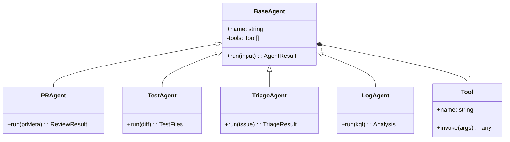

# Class Diagram: Agent Interfaces

```mermaid
classDiagram
  class BaseAgent {
    +name: string
    +run(input): AgentResult
    -tools: Tool[]
  }
  class PRAgent {
    +run(prMeta): ReviewResult
  }
  class TestAgent {
    +run(diff): TestFiles
  }
  class TriageAgent {
    +run(issue): TriageResult
  }
  class LogAgent {
    +run(kql): Analysis
  }
  BaseAgent <|-- PRAgent
  BaseAgent <|-- TestAgent
  BaseAgent <|-- TriageAgent
  BaseAgent <|-- LogAgent

  class Tool {
    +name: string
    +invoke(args): any
  }
  BaseAgent "1" *-- "*" Tool
```
