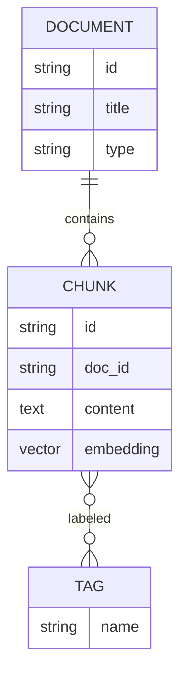

# ER: Knowledge Base for RAG

```mermaid
erDiagram
  DOCUMENT ||--o{ CHUNK : contains
  DOCUMENT {
    string id
    string title
    string type
  }
  CHUNK {
    string id
    string doc_id
    text content
    vector embedding
  }
  CHUNK }o--o{ TAG : labeled
  TAG {
    string name
  }
```
