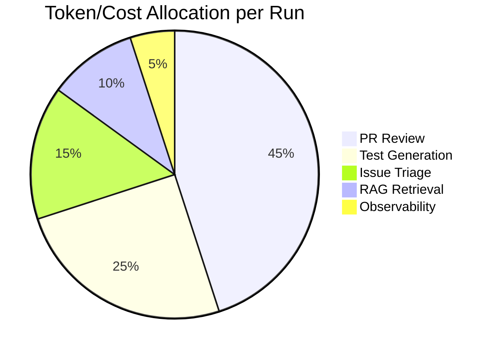

# Pie: Cost/Token Allocation (Illustrative)

```mermaid
pie title Token/Cost Allocation per Run
  "PR Review" : 45
  "Test Generation" : 25
  "Issue Triage" : 15
  "RAG Retrieval" : 10
  "Observability" : 5
```
