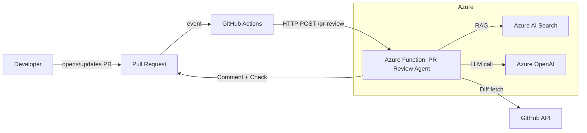
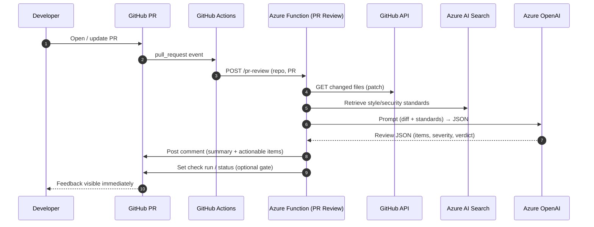
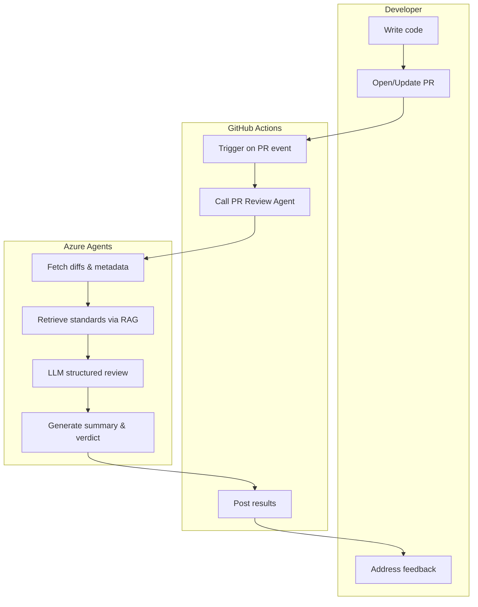

# PR Review Pipeline (Composite Diagrams)

## A) High-Level Flow

```mermaid
flowchart LR
  Dev[Developer] -->|opens/updates PR| PR[Pull Request]
  PR -->|event| Actions[GitHub Actions]
  Actions -->|HTTP POST /pr-review| Func[Azure Function: PR Review Agent]
  Func -->|Diff fetch| GHAPI[GitHub API]
  Func -->|RAG| AIS[Azure AI Search]
  Func -->|LLM call| AOAI[Azure OpenAI]
  Func -->|Comment + Check| PR
  subgraph Azure
    Func
    AIS
    AOAI
  end
```

## B) Sequence (Detailed)

```mermaid
sequenceDiagram
  autonumber
  participant Dev as Developer
  participant PR as GitHub PR
  participant GA as GitHub Actions
  participant AF as Azure Function (PR Review)
  participant GH as GitHub API
  participant AIS as Azure AI Search
  participant AOAI as Azure OpenAI

  Dev->>PR: Open / update PR
  PR->>GA: pull_request event
  GA->>AF: POST /pr-review (repo, PR#, token)
  AF->>GH: GET changed files (patch)
  AF->>AIS: Retrieve style/security standards
  AF->>AOAI: Prompt (diff + standards) → JSON
  AOAI-->>AF: Review JSON (items, severity, verdict)
  AF->>PR: Post comment (summary + actionable items)
  AF->>PR: Set check run / status (optional gate)
  PR-->>Dev: Feedback visible immediately
```

## C) Swimlane (Responsibilities)

```mermaid
flowchart TB
  subgraph Developer
    D1[Write code]
    D2[Open/Update PR]
    D3[Address feedback]
  end
  subgraph GitHub Actions
    G1[Trigger on PR event]
    G2[Call PR Review Agent]
    G3[Post results]
  end
  subgraph Azure Agents
    A1[Fetch diffs & metadata]
    A2[Retrieve standards via RAG]
    A3[LLM structured review]
    A4[Generate summary & verdict]
  end

  D1 --> D2 --> G1 --> G2 --> A1 --> A2 --> A3 --> A4 --> G3 --> D3
```
