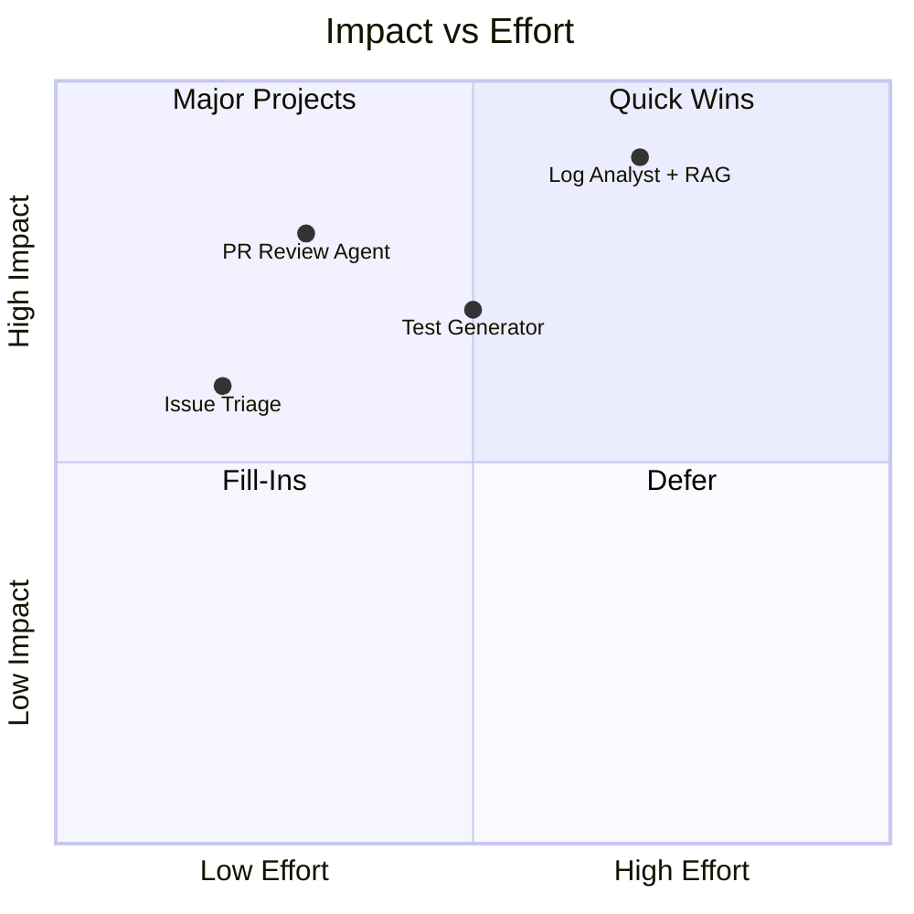

# Quadrant: Impact vs Effort

```mermaid
quadrantChart
  title Impact vs Effort
  x-axis Low Effort --> High Effort
  y-axis Low Impact --> High Impact
  quadrant-1 Quick Wins
  quadrant-2 Major Projects
  quadrant-3 Fill-Ins
  quadrant-4 Defer
  "PR Review Agent" : [0.3, 0.8]
  "Issue Triage" : [0.2, 0.6]
  "Test Generator" : [0.5, 0.7]
  "Log Analyst + RAG" : [0.7, 0.9]
```
