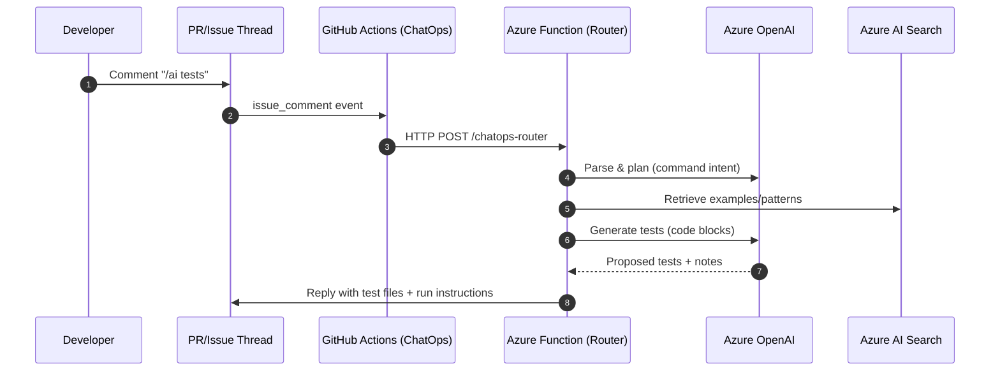

# Sequence: ChatOps Commands

```mermaid
sequenceDiagram
  autonumber
  participant Dev as Developer
  participant PR as PR/Issue Thread
  participant GH as GitHub Actions (ChatOps)
  participant AF as Azure Function (Router)
  participant AOA as Azure OpenAI
  participant AIS as Azure AI Search

  Dev->>PR: Comment "/ai tests"
  PR->>GH: issue_comment event
  GH->>AF: HTTP POST /chatops-router
  AF->>AOA: Parse & plan (command intent)
  AF->>AIS: Retrieve examples/patterns
  AF->>AOA: Generate tests (code blocks)
  AOA-->>AF: Proposed tests + notes
  AF->>PR: Reply with test files + run instructions
```
