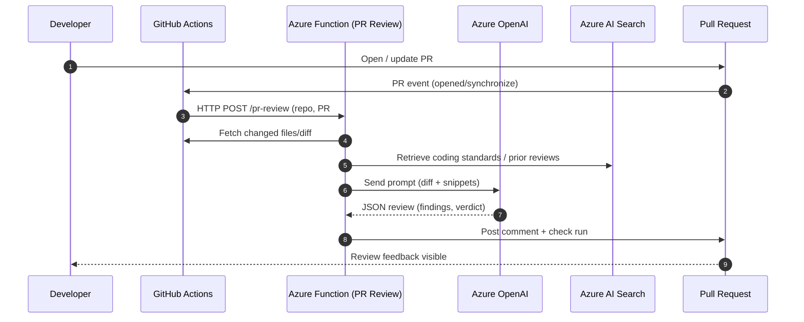

# Sequence: PR Review Agent

```mermaid
sequenceDiagram
  autonumber
  participant Dev as Developer
  participant GH as GitHub Actions
  participant AF as Azure Function (PR Review)
  participant AOA as Azure OpenAI
  participant AIS as Azure AI Search
  participant PR as Pull Request

  Dev->>PR: Open / update PR
  PR->>GH: PR event (opened/synchronize)
  GH->>AF: HTTP POST /pr-review (repo, PR#, token)
  AF->>GH: Fetch changed files/diff
  AF->>AIS: Retrieve coding standards / prior reviews
  AF->>AOA: Send prompt (diff + snippets)
  AOA-->>AF: JSON review (findings, verdict)
  AF->>PR: Post comment + check run
  PR-->>Dev: Review feedback visible
```
