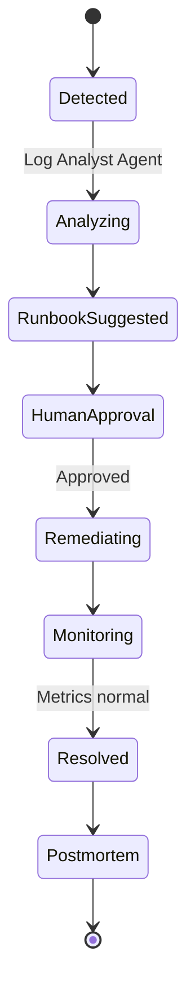

# State: Incident Handling

```mermaid
stateDiagram-v2
  [*] --> Detected
  Detected --> Analyzing: Log Analyst Agent
  Analyzing --> RunbookSuggested
  RunbookSuggested --> HumanApproval
  HumanApproval --> Remediating: Approved
  Remediating --> Monitoring
  Monitoring --> Resolved: Metrics normal
  Resolved --> Postmortem
  Postmortem --> [*]
```
