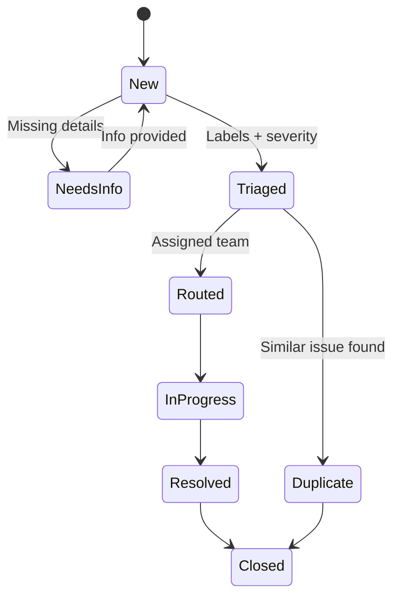

# State: Issue Triage Lifecycle

```mermaid
stateDiagram-v2
  [*] --> New
  New --> NeedsInfo: Missing details
  NeedsInfo --> New: Info provided
  New --> Triaged: Labels + severity
  Triaged --> Duplicate: Similar issue found
  Triaged --> Routed: Assigned team
  Routed --> InProgress
  InProgress --> Resolved
  Resolved --> Closed
  Duplicate --> Closed
```
